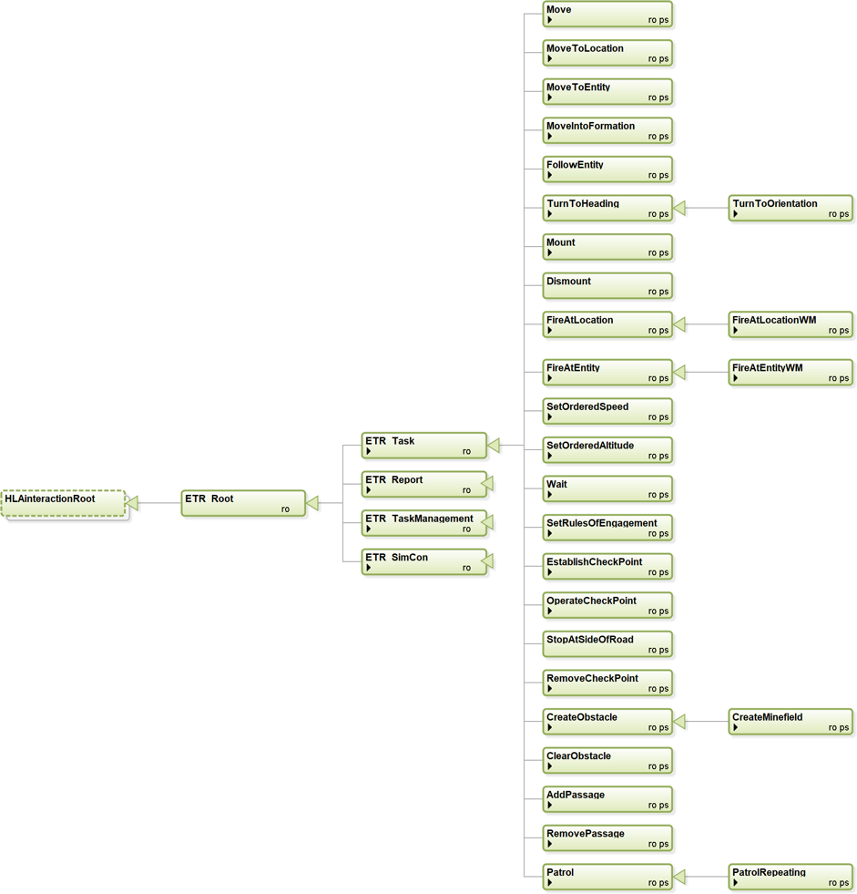

## Entity Tasks
This section summarizes the Entity Task interaction classes in the ETR FOM module.

The following interaction classes are defined:

* Move: Tasks an entity to move in the specified direction for the given duration.
* MoveToLocation: Tasks an entity to move to the specified location.
* MoveToEntity: Tasks an entity to move to another entity.
* MoveIntoFormation: Tasks an aggregate entity to move into the given formation with the given heading.
* FollowEntity: Tasks an entity to follow another entity.
* TurnToHeading: Tasks an entity to turn to the specified heading.
    *	TurnToOrientation: Tasks an entity to turn to a specified orientation, including pitch and roll.
* Mount: Task the entity to mount in the specified entity .
* Dismount: Task the entity to dismount from the entity where it is in.
* FireAtLocation: Tasks an entity to fire at a location.
    *	FireAtLocationWM: Tasks an entity to fire at a location with the specified weapon and munition.
* FireAtEntity: Tasks an entity to fire at another specified entity.
    *	FireAtEntityWM: Tasks an entity to fire at a specified entity with the specified weapon and munition.
* SetOrderedSpeed: Set/Change the ordered speed.
* SetOrderedAltitude: Set/Change the ordered altitude for a flying entity..
* Wait: Tasks an entity to wait a defined duration.
* SetRulesOfEngagement: Change the rules of engagment for an entity.
* EstablishCheckPoint: The task defines a location where an check point shall be established and then operated.
* OperateCheckPoint: The task activates a deactivated check point.
* StopAtSideOfRoad: Tasks an entity to stop at the side of the road.
* RemoveCheckPoint: This task removes the check point that is generated in the EstablishCheckpoint task.
* CreateObstacle: Tasks an entity to create an obstacle with the given geometry.
    *	CreateMinefield: Tasks an entity to create a minefield within the specified geometry.
* ClearObstacle: Task an entity to clear the obstacle or minefield with the given ID.
* AddPassage: Tasks an entity to lay/build a passage between the two given points.
* RemovePassage: Tasks an entity to remove the pasasage with the given ID.
* Patrol: Defines a patrol, covering the path from the current location to the start point of the patrol route, and the patrol route itself.
    *	PatrolRepeating: Task an entity to repeat a patrol task for the given duration.

The following table provides a grouping of tasks per function.

|Functional group|Interactions|
|---|---|
|Movement Tasks| Move MoveToLocation MoveToEntity MoveIntoFormation FollowEntity TurnToHeading TurnToOrientation Patrol PatrolRepeating StopAtSideOfRoad SetOrderedSpeed SetOrderedAltitude|
|Engineering Tasks|CreateObstacle
CreateMinefield
ClearObstacle
CreatePassage
RemovePassage|
|Engagement Tasks|FireAtLocation
FirAtLocationWM
FireAtEntity
FireAtEntityWM
SetRulesOfEngagement|
|Other Tasks|Mount
Dismount
Wait
EstablishCheckPoint
OperateCheckPoint
RemoveCheckPoint|

8.2.2.	ENTITY REPORTS
This section summarizes the Entity Report interaction classes in the ETR FOM module, shown in the figure below.
 
Figure 7-6: Entity Report interaction classes.
The following interaction classes are defined:
1.	StatusReport: Status report from an entity about its own (perceived) state:
a.	PositionStatusReport: Report about the position, speed, and heading of the entity.
b.	DamageStatusReport: Damage status report of the entity.
c.	ResourceStatusReport: Resource status report of the entity.
d.	UnderAttackStatusReport: Report that the entity is under attack.
2.	SpotReport: Spot reports are reports used by all entities to transmit intelligence or information about a spotted enemy, neutral, or unknown entity:
a.	InSensorReport: The entities that have been observed by a specific sensor.
3.	InWeaponRangeReport: The entities that are in range of a specific weapon.
8.2.3.	TASK MANAGEMENT
This section summarizes the Task Management interaction classes in the ETR FOM module, shown in the figure below.
 
Figure 7-6: Task Management interaction classes.

The following interaction classes are defined:
1.	CancelSpecifiedTasks: Cancel all specified tasks. Tasks already started are also cancelled.
2.	CancelAllTasks: Cancel all tasks. Tasks already started are also cancelled.
3.	TaskStatusReport: A report about the status of a task the entity was ordered to execute.
8.2.4.	SIMCON TASKS
This section summarizes the Simulaltion Control interaction classes in the ETR FOM module, shown in the figure below.
 
Figure 7-6: Simulation Control interaction classes.
The following interaction classes are defined:
1.	MagicMove: Place the entity at the specified location.
2.	MagicResource: Change the amount of resources of the entity.
3.	QueryCapabilitiesSupported: Query the set of tasks and reports that the entity supports.
4.	CapabilitiesSupported: Provide the set of tasks and reports that the entity supports.
8.3.	ETR TASK HANDLING
The following sections define how tasks shall be handled.
8.3.1.	ETR TASK MODES
The ETR FOM module defines two modes for a task: non-concurrent mode and concurrent mode.
In the non-concurrent mode the task is placed on the task list for the entity, which serves as a waiting list. Once the task is at the head of the task list, and the currently executing task completes, it is removed from the task list and started. Using this task mode, tasks are executed one after the other.
In the concurrent mode, the task is executed concurrently with other tasks. With this task mode, there is no task list involved.
The mode value is provided for each task. So, at any point in time an entity has zero or more concurrent mode tasks executing and at most one non-concurrent mode task executing, with zero or more non-concurrent mode tasks waiting on the task list.
8.3.2.	ETR TASK STATES
The following states are defined for a task:
•	TaskStatus.Received: the task is received;
•	TaskStatus.Waiting: the task is waiting for execution;
•	TaskStatus.Executing: the task is executing.
The task state diagram is shown below.
  
A)	Received State
A task in the Received state shall be handled in the following way:
1.	Determine if the task is supported. The determination is made by the federate application in accordance with section 8.4.3.
2.	If the task is not supported then
a.	A TaskStatusReport (refused) shall be returned to the Tasker.
b.	The task is removed.
3.	Else
a.	For a non-concurrent mode task:
i.	The task shall be placed in the entity task list in accordance with section 8.3.3.
b.	A TaskStatusReport (accepted) shall be returned to the Tasker.
c.	The task shall transition to the Waiting state.
B)	Waiting State
A task in the Waiting state shall be handled in the following way:
1.	Determine if the task can start using the following conditions:
a.	For a non-concurrent mode task:
i.	The task’s taskee is not executioning a task, and
ii.	The task is at head of the task list, and
iii.	The task has no StartWhen time (i.e. the StartWhen is undefined), or the task has a StartWhen time and this time is less than or equal to the current time.
b.	For a concurrent mode task:
i.	The task has no StartWhen time (i.e. the StartWhen is undefined), or the task has a StartWhen time and this time is less than or equal to the current time, and
ii.	The task does not conflict with other executing tasks (see section 8.3.4).
2.	If the task can start then
a.	For a non-concurrent mode task:
i.	The task shall be removed from the task list.
b.	A TaskStatusReport (executing) shall be returned to the Tasker.
c.	The task shall transition to the Executing state.
3.	Else
a.	The task shall remain in the Waiting state, even if the current time has passed the time specified in the StartWhen of the task.
C)	Executing State
A task in the Executing state shall be handled in the following way:
1.	Determine if the task has completed. The conditions are scenario specific and the determination is up to the federate application.
2.	If the task has completed then
a.	A TaskStatusReport (completed) shall be returned to the Tasker.
b.	The task is removed.
3.	Else
a.	The task shall remain in the Executing state.
D)	TaskStatus State
A task in the TaskStatus state shall be handled as specified in the substates, and also in the following way:
1.	If the task is cancelled by either a CancelAllTasks or CancelSpecifiedTask then
a.	A TaskStatusReport (cancelled) shall be returned to the Tasker.
b.	The task is removed.
2.	If the task cannot be handled due to an internal federate application error then
a.	A TaskStatusReport (error) shall be returned to the Tasker and a description of the error shall be included in the message.
b.	The task is removed.
8.3.3.	TASK LIST ORDERING
Each entity has a task list for non-concurrent mode tasks. The task at the head of the list is the first task to be started once the currently executing task completes. The ordering of tasks in the task list shall be according to the following figure.

 
The tasklist shall be divided in two parts: a left part that contains tasks where the StartWhen is specified, and a right part that contains tasks where no StartWhen is specified. The division point shall mark the head of the left part and the tail of the right part. A part is empty if there are no tasks for that part.
A task shall be placed in the task list as follows:
1.	If the StartWhen time of the task is specified then the task shall be placed in the left part of the task list, using the StartWhen time to order the tasks in this part (with decreasing StartWhen value towards the head of the list).
2.	If the StartWhen time of the task is not specified then the task shall be placed at the tail of the right part of the task list.
8.3.4.	CONCURRENT TASKS
The following table defines which tasks for the same entity can execute concurrently. The table shows which tasks can transition from the Waiting state to the Execution state given another task that is already in Execution state for the same entity. 

Number	Task in Execution state	Tasks allowed to go to Execution state
1	Move	6, 7, 10, 11, 12, 13, 14, 15, 17, 22
2	MoveToLocation	10, 11, 12, 13, 14, 15, 17, 22
3	MoveToEntity	10, 11, 12, 13, 14, 15, 17, 22
4	MoveIntoFormation	10, 11, 12, 13, 14, 15, 17
5	FollowEntity	10, 11, 12, 13, 14, 15, 17
6	TurnToHeading	1
7	TurnToOrientation	1
8	MountVehicle	
9	DismountVehickle	
10	FireAtLocation	1, 2, 3, 4, 5, 18, 19
11	FireAtLocationWM	1, 2, 3, 4, 5, 18, 19
12	FireAtEntity	1, 2, 3, 4, 5, 18, 19
13	FireAtEntityWM	1, 2, 3, 4, 5, 18, 19
14	SetOrderedSpeed	1, 2, 3, 4, 5, 18, 19
15	SetOrderedAltitude	1, 2, 3, 4, 5, 18, 19
16	Wait	
17	SetRulesOfEngagement	1, 2, 3, 4, 5, 18, 19
18	Patrol	10, 11, 12, 13, 14, 15, 17
19	PatrolRepeating	10, 11, 12, 13, 14, 15, 17
20	EstablishCheckPoint	
21	OperateCheckPoint	
22	StopAtSideOfRoad	1, 2, 3
23	RemoveCheckPoint	
24	CreateObstacle	
25	CreateMinefield	
26	ClearObstacle	
27	AddPassage	
28	RemovePassage	

8.4.	ETR SIMCON HANDLING
A Simulation Control message for an entity shall be executed immediately, regardless the presence of any (concurrent or non-concurrent) executing task.
8.4.1.	MAGIC MOVE
A MagicMove for an entity shall implicitly cancel all tasks for the entity. A TaskStatusReport (cancelled) shall be issued for each task in accordance with the task state diagram.
8.4.2.	MAGIC RESOURCE
A MagicResource shall update the entity resources. Waiting or executing tasks of the entity are effected in the sense that these tasks have more or less resources available after the MagicResource.
8.4.3.	ENTITY TASK AND REPORT CAPABILITIES
It shall be possible to query an entity for the ETR tasks and ETR reports that it supports. The set of tasks and reports that an entity supports is implementation specific, and shall be used in the Received state of a task to determine if the task is supported.
With the interaction class QueryCapabilitiesSupported an entity can be queried for the supported ETR tasks and ETR reports. The result is provided via the interaction class CapabilitiesSupported.
8.5.	IMPLEMENTATION REQUIREMENTS
This section lists the requirements for federate applications that implement Entity Tasking and Reporting. The requirements are provided from receiver point of view (entity taskee, the federate application modelling the entity) and sender point of view (entity tasker, the federate application sending a task or receiving a report for an entity).

The receiver:
1.	SHALL support all ETR TaskManagement and ETR SimCon classes.
2.	MAY support a subset of the ETR Task and ETR Report classes.
3.	SHALL provide all interaction class parameters when sending an ETR interaction.
The sender:
4.	SHALL provide all interaction class parameters when sending an ETR interaction.
In addition, for the receiver, the following SHALL be documented in the federation agreements:
5.	Distance tolerances of supported tasks (for the tasks Mount, EstablishCheckPoint, OperateCheckPoint, RemoveCheckPoint, CreateObstacle, ClearObstacle, CreateMinefield, AddPassage, and RemovePassage).
6.	Entities that provide ETR Reports.
7.	Time frequencies and conditions for the supported ETR Reports.
8.	Modeling agreements related to checkpoints (if supported, see EstablishCheckPoint, OperateCheckPoint, and RemoveCheckPoint).
9.	Modeling agreements related to minefields (if supported, see CreateMineField).

INTENTIONALLY BLANK 
