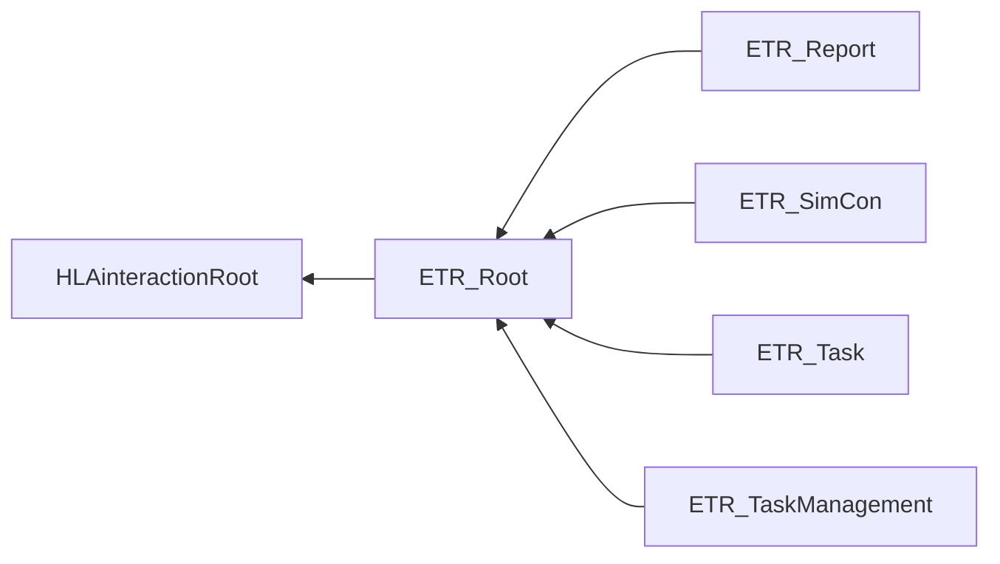
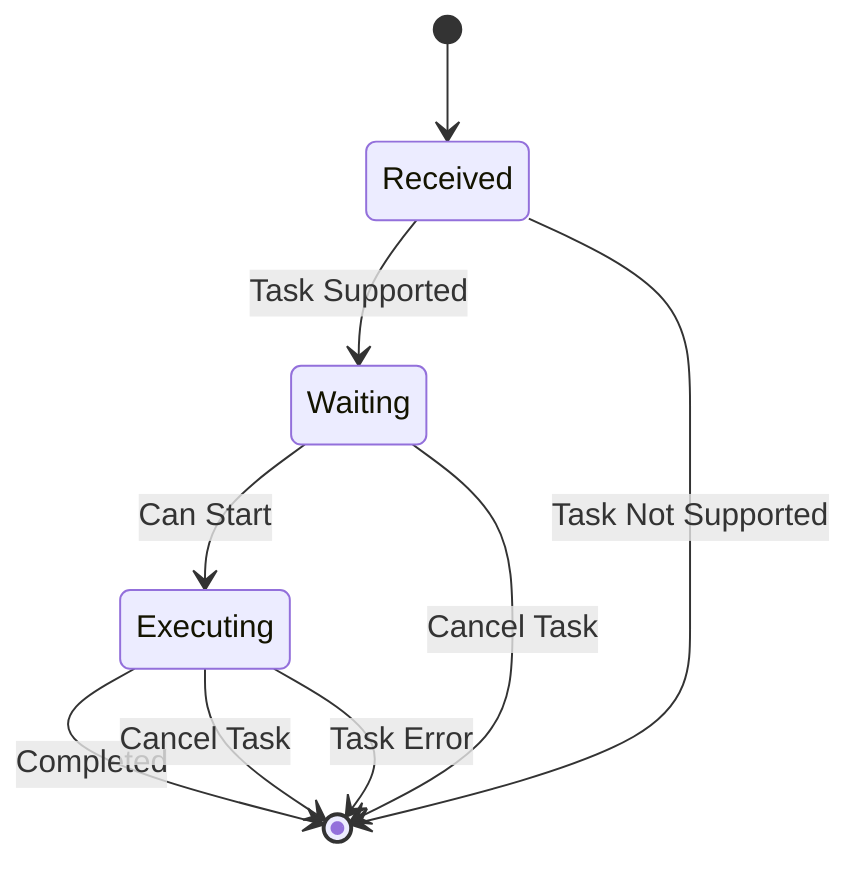
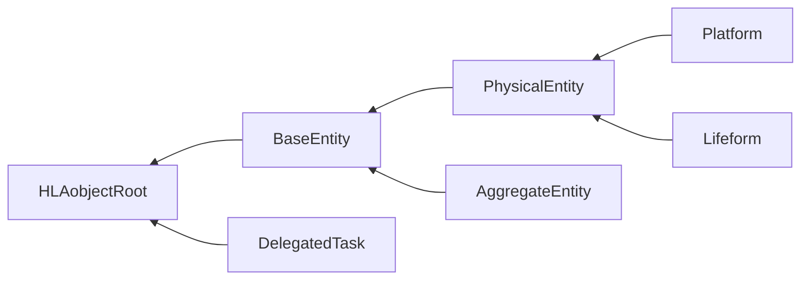
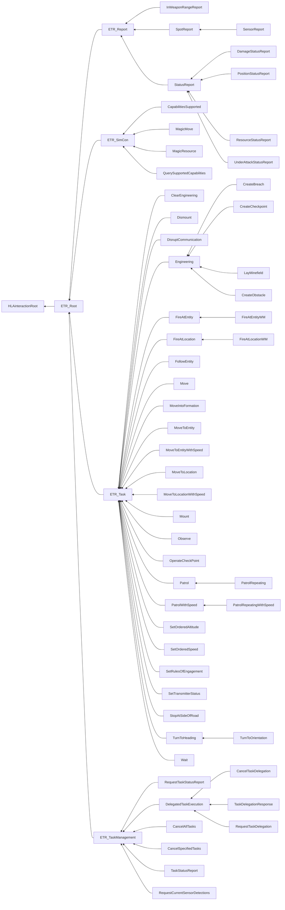

# NETN-ETR
|Version| Date| Dependencies|
|---|---|---|
|3.0 |2023-03-28|NETN-BASE, RPR-SE|

The NETN-ETR FOM module provides a common standard interface for sending tasks to simulated entities represented in a federated distributed simulation. NETN-ETR contains common low-level tasks that can easily be interpreted and executed by simulators that model the behaviour of entities. It also defines a set of reports to provide status information, including the status of the tasks being executed by simulated entities.

The NATO Education and Training Network (NETN) Entity Tasking and Reports (ETR) Module is a specification of how to represent simulation task requests provided to participants in a federated distributed simulation and simulator reports sent during the execution of tasks. 
        
The specification is based on IEEE 1516 High Level Arhitecture (HLA) Object Model Template (OMT) and is primarily intended to support interoperability in a federated simulation (federation) based on HLA. An HLA-based Federation Object Model (FOM) is used to specify types of data and how it is encoded on the network. The NETN-ETR FOM module is available as an XML file for use in HLA-based federations.
        

 The NETN-ETR FOM module is simulation oriented and focuses on tasks with fine granularity: 
    
* It enables the transformation of command and control messages into tasks that can be executed by a simulator. 
* It defines status reports that can be used for producing command and control reports needed for decision-making. 
* It supports the modelling of simulated command and control interactions between federates in a distributed simulation, for example during an MRM disaggregation process. 
* It contains a comprehensive set of tasks and reports that can easily be interpreted and executed by simulators. 
* It reflects the capabilities commonly found in COTS Computer Generated Forces (CGF) tools, but it is independent of a specific COTS CGF tool, agent framework, or agent modelling paradigm. 
* It is independent of any specific doctrine or tactics. 

An entity in ETR can be either a physical entity (e.g. platform or lifeform) or an aggregate entity. If a task or report relates to only a physical entity or to only an aggregate entity, then this is specified in the definition of the task. In the definition of each task, it is not specified how an entity (physical or aggregate) will / should perform the task. 	

## Overview
The NETN-ETR FOM modules define extensions of the RPR-FOM object classes `BaseEntity`, `AggregateEntity`, `Lifeform`, and `Platform` to represent the planned, current and previous tasks assigned to entities. In addition, the progress of currently executing tasks is also published in the federation. 

Tasking and sending of reports are represented as interactions. 

* `ETR_Root` is the root class for all the Entity Tasking and Reporting (ETR) interactions.
* `ETR_Task` is a base class for all task interactions.
* `ETR_Report` is a base class for all report interactions.
* `ETR_TaskManagement`  is a base class for task management interactions.
* `ETR_SimCon`  is a base class for Simulation Control interactions.

### Task Delegation

### Entity Tasks
This section summarizes the Entity Task interaction classes in the ETR FOM module.

|Task|Description|
|---|---|
|ClearEngineering|Tasking of an entity to clear any SeObject with the given UUID. The tasked entity should be within a certain distance (tolerance specified in the federation agreement) of one of the points of the geometry of the obstacle.|
|Dismount|Tasking of an entity to dismount from a mounted position. When the task is completed, the tasked entity is no longer attached to or embarked in another entity.|
|DisruptCommunication|Tasking of an entity to introduce a communication network disruption.|
|Engineering|Tasking of an entity to preform field engineering (represented by SeObject from NETN-SE)|
|CreateBreach|Creates a breach or passage on a Se-Object. Discriminant on GeometryType decides if it is a Point, Line or Areal breach.|
|CreateCheckpoint||
|LayMinefield|Tasking of an entity to create a minefield within the specified geometry. When the task is completed, a minefield object should be published in the federation (e.g. NETN-SE Minefield). This tasking interaction is different from the RPR-FOM MinefieldObjectTransaction interaction, which asks a federate to create a minefield magically.|
|FireAtEntity|Tasking of an entity to fire at another specified target entity.|
|FireAtEntityWM|Tasking of an entity to fire at a specified target entity with the specified weapon and munition data.|
|FireAtLocation|Tasking of an entity to fire at a location.|
|FireAtLocationWM|Tasking of an entity to fire at a location with the specified weapon and munition.|
|FollowEntity|Tasking of an entity to follow another entity at a specified distance.|
|Move|Tasking of an entity to move in a specified direction for a given duration of time.|
|MoveIntoFormation|Tasking of an entity to move into the given formation on the given location with the given heading.|
|MoveToEntity|Tasking of an entity to move to another entity. If a path is provided, the entity should follow the path as its route to the entity. The entity should align with the path from its current position to the nearest position or waypoint on the path. The entity should leave the path at position or waypoint on the path closest to the destination entity. The entity moves directly towards the destination entity if no path (or a zero-length path) is provided.|
|MoveToEntityWithSpeed|Tasking of an entity to move to another entity. If a path with speed is provided, the entity should follow the path as its route to the entity. The entity should align with the path from its current position to the nearest position or waypoint on the path. The entity should leave the path at position or waypoint on the path closest to the destination entity. The entity moves directly towards the destination entity if no path (or a zero-length path) is provided.|
|MoveToLocation|Tasking of an entity to move to the specified destination location. If a path is provided, the entity should follow the path as its route to the destination. The entity should align with the path from its current position to the nearest position or waypoint on the path. The entity should leave the path at position or waypoint on the path closest to the destination. The entity moves directly towards the destination location if no path (or a zero-length path) is provided.|
|MoveToLocationWithSpeed|Tasking of an entity to move to the specified destination location with a given speed for each waypoint. If a path is provided, the entity should follow the path as its route to the destination. The entity should align with the path from its current position to the nearest position or waypoint on the path. The entity should leave the path at position or waypoint on the path closest to the destination. The entity moves directly towards the destination location if no path (or a zero-length path) is provided.|
|Mount|Tasking of entity to mount the specified entity. The tasked entity should be within a certain distance (tolerance specified in the federation agreements) of the location of the entity to mount.|
|Observe|Tasking of an entity to observe an area.|
|OperateCheckPoint|Tasking of an entity to operate a checkpoint. The tasked entity should be within a certain distance (tolerance specified in the federation agreements) of the location of the checkpoint. If not, a separate move task should be issued first. The tasked entity activates an inactive checkpoint and operates the checkpoint for the specified duration of time.|
|Patrol|Tasking of an entity to perform a patrol. The tasked entity moves from its current position to the start of the patrol route and then moves according to patrol route from its start point in the path, through all waypoints.|
|PatrolRepeating|Tasking of an entity to repeat a patrol for a given duration. When the duration time has passed, then the last cycle of the patrol is completed before the task ends. If the time of a cycle takes longer then the interval time, then the cycle starts directly (without delay). If the time of a cycle takes less than the interval time, then the entity waits at the first point of the patrol route until the next cycle is started.|
|PatrolWithSpeed|Tasking of an entity to perform a patrol. The tasked entity moves from its current position to the start of the patrol route and then moves according to patrol route from its start point in the path, through all waypoints with the speed specified.|
|PatrolRepeatingWithSpeed|Tasking of an entity to repeat a patrol for a given duration. When the duration time has passed, then the last cycle of the patrol is completed before the task ends. If the time of a cycle takes longer then the interval time, then the cycle starts directly (without delay). If the time of a cycle takes less than the interval time, then the entity waits at the first point of the patrol route until the next cycle is started.|
|SetOrderedAltitude|Tasking of an entity to set move to specified altitude.|
|SetOrderedSpeed|Tasking of an entity to change speed.|
|SetRulesOfEngagement|Tasking of an entity to change its rules of engagement.|
|SetTransmitterStatus|Tasking of an entity to switch on/off all of its transmitters.|
|StopAtSideOfRoad|Tasking of an entity to stop at the side of the road. This task is only relevant for an entity that is moving along a road to a destination. The executing move task is cancelled, and a new move is defined towards a position at the side of the road (the simulator has to calculate this location).|
|TurnToHeading|Tasking of an entity to turn to the specified heading.|
|TurnToOrientation|Tasking of an entity to rotate to a specified orientation, including pitch and roll.|
|Wait|Tasking of an entity to wait for a duration of time.|

### Entity Reports
This section summarizes the Entity Report interaction classes in the ETR FOM module, shown in the figure below.

|Report|Description|
|---|---|
|InWeaponRangeReport|Report on a unit's ability to reach specific targets with its weapon systems.|
|SpotReport|Report on a unit's awareness of spotted entities.|
|SensorReport|Report on a unit's sensor detection of entities.|
|StatusReport|Report on a unit's own (perceived) state. This report should be generated with a frequency specified in the federation agreements.|
|DamageStatusReport|Report on a unit's damage status.|
|PositionStatusReport|Report on a unit's position, speed, and heading.|
|ResourceStatusReport|Report on a unit's remaining amount resources.|
|UnderAttackStatusReport|Report from a unit that it is under attack.|

### Task Management
This section summarizes the Task Management interaction classes in the ETR FOM module, shown in the figure below.

|Task Management|Description|
|---|---|
|RequestTaskStatusReport|Requests the responsible federate to send TaskStatusReport interactions for the specified tasks. For this class, the Taskee parameter is Optional, and refers to the entity for whom task status reports are being requested. If omitted, request refers to all tasks specified in Tasks. At least one of Taskee or Tasks must be specified.|
|CancelTaskDelegation|Send a request to target federate to cancel current remote task.|
|TaskDelegationResponse|Response if the task will be executed.|
|RequestTaskDelegation|Interaction to request a remote execution of a task.|
|CancelAllTasks|Management task to an entity to cancel all queued and ongoing tasks.|
|CancelSpecifiedTasks|Management task to an entity to cancel all specified tasks.|
|TaskStatusReport|A management task report regarding the status of a specific task assigned to an entity.|
|RequestCurrentSensorDetections|Requests resending of SensorReports for all current sensor detections.|

### Simulation Control
This section summarizes the Simulation Control interaction classes in the ETR FOM module, shown in the figure below.

|Simulation Control|Description|
|---|---|
|CapabilitiesSupported|Provides the set of ETR_Task, ETR_SimCon and ETR_Report interactions that the federate modelling the entity supports. This interaction is in response to a QuerySupportedCapabilities.|
|MagicMove|A simulation control task that instructs the entity to immediately jump to the specified location and update the new position and heading.|
|MagicResource|A simulation control task that instructs the entity to set amount of available resources immediately|
|QuerySupportedCapabilities|Query which tasks, reports and SimCon actions that an entity supports. The queried entity shall respond with a CapabilitiesSupported message.|

## ETR Task Processing

The following sections define how tasks shall be handled.

### ETR Task Modes

The ETR FOM module defines two modes for a task: non-concurrent mode and concurrent mode.

In the non-concurrent mode the task is placed on the non-concurrent task list for the entity, which serves as a waiting list. Once the task is at the head of the task list, and the currently executing task completes, it is removed from the non-concurrent task list and started. In this task mode, tasks are executed one after the other.

In the concurrent mode, the task is placed on the concurrent task list for the entity. This list also serves as a waiting list. Once the task is at the head of the task list, and it can execute concurrently with already running tasks, it is removed from the task list and started.

When no task is executed, the task at the head of the non-concurrent task list has a higher priority to start then the task at the head of the concurrent task list.

### ETR Task States

The following states are defined for a task:

* TaskStatus.Received: the task is received;
* TaskStatus.Waiting: the task is waiting for execution;
* TaskStatus.Executing: the task is running.

The task state diagram is shown below.

#### Received State
A task in the Received state shall be handled in the following way:

1. Determine if the task is supported. The determination is made by the federate application in accordance with [Entity Task and Reporting Capabilities](#Entity-Task-and-Reporting-Capabilities).
2. If the task is not supported then
    * A `TaskStatusReport` (refused) shall be returned to the Tasker.
    * The task is removed.
3. Else
    * The task shall be placed in either the non-concurrent task list or the concurrent task list depending on the task mode, in accordance with [Task List Ordering](#Task-List-Ordering).
    * A `TaskStatusReport` (accepted) shall be returned to the Tasker.
    * The task shall transition to the Waiting state.

#### Waiting State
A task in the Waiting state shall be handled in the following way:
1.  Determine if the task can start using the following conditions:
    * For a non-concurrent mode task:
        * The task is at the head of the non-concurrent task list, and
        * The task’s taskee is not executing a task, and
        * The task has no `StartWhen` time (i.e. the StartWhen is undefined), or the task has a StartWhen time and this time is less than or equal to the current time.
    * For a concurrent mode task:
        * The task is at the head of the concurrent task list and
        * The task has no `StartWhen` time (i.e. the StartWhen is undefined), or the task has a StartWhen time and this time is less than or equal to the current time, and
        * The task does not conflict with other executing tasks, see [Concurrent Tasks](#Concurrent-Tasks).
2.  If the task can start then
    - The task shall be removed from the task list.
    - A `TaskStatusReport` (executing) shall be returned to the Tasker.
    - The task shall transition to the Executing state.
3.  Else
    * The task shall remain in the Waiting state, even if the current time has passed the time specified in the `StartWhen` parameter of the task.

#### Executing State
A task in the Executing state shall be handled in the following way:

1.  Determine if the task has completed. The conditions are scenario specific, and the determination is up to the federate application.
2.  If the task has completed then
    * A `TaskStatusReport` (completed) shall be returned to the Tasker.
    * The task is removed.
3.  Else
    * The task shall remain in the Executing state.

#### TaskStatus State
A task in the TaskStatus state shall be handled as specified in the sub-states, and also in the following way:

1.  If the task is cancelled by either a `CancelAllTasks` or `CancelSpecifiedTask` then
    * A `TaskStatusReport` (cancelled) shall be returned to the Tasker.
    * The task is removed.
2.  If the task cannot be handled due to an internal federate application error then
    * A `TaskStatusReport` (error) shall be returned to the Tasker, and a description of the error shall be included in the message.
    * The task is removed.

### Task List Ordering

Each entity has a non-concurrent task list for tasks in non-concurrent mode and a concurrent task list for tasks in concurrent mode. The task at the head of the non-concurrent task list is the first task to be started once all currently executing tasks are completed. The task at the head of the concurrent task list is the first task to be started when it can run concurrently with all executing tasks or when all currently executing tasks are completed. The ordering of the tasks in both lists shall be according to the following figure.

The tasklist shall be divided into two parts: a left part that contains tasks where the StartWhen is specified, and a right part that contains tasks where no StartWhen is specified. The division point shall mark the head of the left part and the tail of the right part. A part is empty if there are no tasks for that part.

A task shall be placed in the task list as follows:

1.  If the StartWhen time of the task is specified, then the task shall be placed in the left part of the task list, using the StartWhen time to order the tasks in this part (with decreasing StartWhen value towards the head of the list).
2.  If the StartWhen time of the task is not specified, then the task shall be placed at the tail of the right part of the task list.

### Concurrent Tasks

In order to define which tasks can run concurrently, we divide the tasks in four task groups:

| Movement group | Weapon group | SetAction group | Single group |
| --- | --- | --- | --- |
| Move | FireAtLocation | SetOrderedSpeed | Mount |
| MoveToLocation | FireAtLocationWM | SetOrderedAltitude | Dismount |
| MoveToEntity | FireAtEntity | SetRulesOfEngagement | EstablishCheckPoint |
| MoveIntoFormation | FireAtEntityWM | SetTransmitterStatus | OperateCheckPoint |
| FollowEntity || DisruptCommunication | RemoveCheckPoint |
| TurnToHeading ||| CreateObstacle |
| TurnToOrientation ||| CreateMinefield |
| Wait | | | ClearObstacle |
| Patrol | | | AddPassage |
| PatrolRepeating | | | RemovePassage |
| StopAtSideOfRoad | | | |
| Observe | | | |

There are the following restrictions regarding concurrency:

1. Movement group:
   1. Only one task in this group can be executed at the same time.
   2. A task in this group can run together with a task in the Weapon or SetAction group.

2. Weapon group:
   1. Only one task in this group can be executed at the same time.
   2. A task in this group can run together with a task in the Movement or SetAction group.

3. SetAction group:
   1. Multiple tasks in this group can be executed at the same time.
   2. A task in this group can run together with a task in the Movement or Weapon group.

4. Single group:
   1. Only one task in this group can be executed at the same time.
   2. A task in this group can not run together with a task in another group.

So, several tasks can be executed at the same time. For example a `Patrol`, `SetOrderedSpeed` and `FireAtEntity`; or a `MoveToLocation`, `SetOrderedAltitude` and `FireAtLocation`. A `FireAtEntity` task can be timed while executing a `MoveToLocation` task by using the `StartWhen` time. It is also possible to change the speed or altitude after a certain time during a movement by using the `StartWhen` time for the `SetOrderedSpeed` or `SetOrderedAltitude` task.

## ETR Simulation Control
A Simulation Control task for an entity shall be executed immediately, regardless of the presence of any (concurrent or non-concurrent) executing task.

### Entity Task and Reporting Capabilities

It shall be possible to query an entity for the ETR tasks and ETR reports that it supports. The set of tasks and reports that an entity supports is implementation-specific and shall be used in the Received state of a task to determine if the task is supported.

With the interaction class `QuerySupportedCapabilities` an entity can be queried for the supported ETR tasks and ETR reports. The result is provided via the interaction class `CapabilitiesSupported`.

### Magic Move
A `MagicMove` for an entity shall implicitly cancel all tasks for the entity. A `TaskStatusReport` (cancelled) shall be issued for each task in accordance with the task state diagram.

### Magic Resources
A `MagicResource` shall update the entity resources. Waiting or executing tasks of the entity are affected in the sense that these tasks have more or less resources available after the `MagicResource`.

## Implementation Requirements
This section lists the requirements for applications that implement Entity Tasking and Reporting. The requirements are provided from receiver point of view (entity taskee, the federate application modelling the entity) and sender point of view (entity tasker, the federate application sending a task or receiving a report for an entity).

The receiver:
1.  SHALL support all ETR TaskManagement and ETR SimCon classes.
2.  MAY support a subset of the ETR Task and ETR Report classes.
3.  SHALL provide the interaction class parameters in accordance with the parameter-semantics in the FOM.

The sender:
1.  SHALL provide the interaction class parameters in accordance with the parameter-semantics in the FOM.

In addition, for the receiver, the following SHALL be documented in the federation agreements:
1.  Distance tolerances of supported tasks (for the tasks `Mount`, `EstablishCheckPoint`, `OperateCheckPoint`, `RemoveCheckPoint`, `CreateObstacle`, `ClearObstacle`, `CreateMinefield`, `AddPassage`, and `RemovePassage`).
2.  Entities that provide ETR Reports.
3.  Time frequencies and conditions for the supported ETR Reports.
4.  Modelling agreements related to checkpoints (if supported, see `EstablishCheckPoint`, `OperateCheckPoint`, and `RemoveCheckPoint`).
5.  Modelling agreements related to minefields (if supported, see `CreateMineField`).

## Object Classes

Note that inherited and dependency attributes are not included in the description of object classes.

### BaseEntity

A base class of aggregate and discrete scenario domain participants. The BaseEntity class is characterized by being located at a particular location in space and independently movable, if capable of movement at all. It specifically excludes elements normally considered to be a component of another element. The BaseEntity class is intended to be a container for common attributes for entities of this type. Since it lacks sufficient class specific attributes that are required for simulation purposes, federates cannot publish objects of this class. Certain simulation management federates, e.g. viewers, may subscribe to this class. Simulation federates will normally subscribe to one of the subclasses, to gain the extra information required to properly simulate the entity.

|Attribute|Datatype|Semantics|
|---|---|---|
|Activity|AggregateMissionEnum16||
|SupportedTasks|ArrayOfTaskTypes||

### Platform

A physical object under the control of armed forces upon which sensor, communication, or weapon systems may be mounted.

|Attribute|Datatype|Semantics|
|---|---|---|
|ProgressOfCurrentTasks|ArrayOfTaskProgress|Optional. Array of progress for current tasks.|
|DefinitionsOfCurrentTasks|ArrayOfTaskDefinitions|Optional. Array of tasks currently being executed.|
|PreviousTasks|ArrayOfTaskDefinitions|Optional. Array of completed or cancelled tasks.|
|PlannedTasks|ArrayOfTaskDefinitions|Optional. Array of all planned tasks.|

### Lifeform

A living military platform (human or not).

|Attribute|Datatype|Semantics|
|---|---|---|
|ProgressOfCurrentTasks|ArrayOfTaskProgress|Optional. Array of progress for current tasks.|
|DefinitionsOfCurrentTasks|ArrayOfTaskDefinitions|Optional. Array of tasks currently being executed.|
|PreviousTasks|ArrayOfTaskDefinitions|Optional. Array of completed or cancelled tasks.|
|PlannedTasks|ArrayOfTaskDefinitions|Optional. Array of all planned tasks.|

### AggregateEntity

A group of one or more separate objects that operate together as part of an organization. These objects may be discrete, may be other aggregate objects, or may be a mixture of both.

|Attribute|Datatype|Semantics|
|---|---|---|
|ProgressOfCurrentTasks|ArrayOfTaskProgress|Optional. Array of progress for current tasks.|
|DefinitionsOfCurrentTasks|ArrayOfTaskDefinitions|Optional. Array of tasks currently being executed.|
|PreviousTasks|ArrayOfTaskDefinitions|Optional. Array of completed or cancelled tasks.|
|PlannedTasks|ArrayOfTaskDefinitions|Optional. Array of all planned tasks.|

### DelegatedTask

Object to represent a task independently in the federation when needed.

|Attribute|Datatype|Semantics|
|---|---|---|
|TaskDefinition|TaskDefinition|Required. Definition description of the task represented.|
|TaskProgress|TaskProgress|Required. Progress description of the task represented.|

## Interaction Classes

Note that inherited and dependency parameters are not included in the description of interaction classes.

### ETR_Report

A base interaction class for more specialized report interaction classes.

|Parameter|Datatype|Semantics|
|---|---|---|
|ReportId|UUID|Required. Uniqie identifier for the report.|
|When|Datetime18|Required. Date and time when the reported status was valid.|
|CommunicationNetworkIds|ArrayOfText64|Optional. Reference to communication networks (NETN-COM) used to transfer report messages. If not provided, the report transmission should not be modelled and federates should receive and act on the report messages directly.|
|Comments|HLAunicodeString|Optional. Any additional comments associated with the report.|

### InWeaponRangeReport

Report on a unit's ability to reach specific targets with its weapon systems.

|Parameter|Datatype|Semantics|
|---|---|---|
|Observer|UUID|Required. Reference to the entity that observed another entity in range of its weapons.|
|WeaponType|EntityTypeStruct|Required. The type of the weapon that is in range.|
|EntitiesInWeaponRange|ArrayOfUuid|Required. Reference to entities in rage of the weapon.|

### SpotReport

Report on a unit's awareness of spotted entities.

|Parameter|Datatype|Semantics|
|---|---|---|
|Observer|UUID|Required. Entity that observed the enemy (or neutral/unknown entity) and sends the spot report.|
|IdentificationLevel|IdentificationLevelEnum8|Required. The identification level of the entit(y)(ies) spotted.|
|SpottedEntities|ArrayOfSpottedEntities|Required. Spotted entities at the time specified in the parameter 'When'.|

### SensorReport

Report on a unit's sensor detection of entities.

|Parameter|Datatype|Semantics|
|---|---|---|
|SensorType|EntityTypeStruct|Required. The type of the sensor that detected the entities.|

### StatusReport

Report on a unit's own (perceived) state. This report should be generated with a frequency specified in the federation agreements.

|Parameter|Datatype|Semantics|
|---|---|---|
|EntityId|UUID|Required. The entity that is reported about.|

### DamageStatusReport

Report on a unit's damage status.

|Parameter|Datatype|Semantics|
|---|---|---|
|DamageType|DamageStatusEnhancedEnum32|Required. Damage state of the reported entity.|

### PositionStatusReport

Report on a unit's position, speed, and heading.

|Parameter|Datatype|Semantics|
|---|---|---|
|Position|WorldLocationStruct|Required. Position of the entity at the specified time.|
|Heading|AngleRadianFloat32|Required. Heading of the entity.|
|Speed|VelocityMeterPerSecondFloat32|Required. Speed of the entity.|

### ResourceStatusReport

Report on a unit's remaining amount resources.

|Parameter|Datatype|Semantics|
|---|---|---|
|Resource|SupplyStruct|Required. The type of resource and remaining quantity.|

### UnderAttackStatusReport

Report from a unit that it is under attack.

|Parameter|Datatype|Semantics|
|---|---|---|
|FromDirection|AngleRadianFloat32|Required. Direction from which the entity is attacked, between 0..2π or -1 when not specified.|
|Severeness|AttackTypeEnum32|Required. Severeness of the attack upon the reporting entity.|

### ETR_SimCon

A base interaction class for EXCON Task interaction classes.

|Parameter|Datatype|Semantics|
|---|---|---|
|TaskId|UUID|Required. Uniqie identifier for the simulation control task.|
|Taskee|UUID|Required. Reference to the entity that should execute the task.|
|Tasker|Callsign|Optional. Indentifies the commander of the task.|
|MainTaskId|UUID|Optional. Unique ID of the main task.|
|PreviousTaskId|UUID|Optional. Unique ID of the previous task.|
|NextTaskId|UUID|Optional. Unique ID of the next task.|

### CapabilitiesSupported

Provides the set of ETR_Task, ETR_SimCon and ETR_Report interactions that the federate modelling the entity supports. This interaction is in response to a QuerySupportedCapabilities.

|Parameter|Datatype|Semantics|
|---|---|---|
|CapabilityNames|ArrayOfTaskTypes|Required. Array of task types that the entity supports.|

### MagicMove

A simulation control task that instructs the entity to immediately jump to the specified location and update the new position and heading.

|Parameter|Datatype|Semantics|
|---|---|---|
|Location|WorldLocationStruct|Required. Location of the entity.|
|Heading|AngleRadianFloat32|Required. Heading of the entity.|
|LocationUuid|UUID|Optional. The new location for the entity. Refered by a UUID.|

### MagicResource

A simulation control task that instructs the entity to set amount of available resources immediately

|Parameter|Datatype|Semantics|
|---|---|---|
|Resource|SupplyStruct|Required. Defines the resource type that will get a new quantity value.|

### QuerySupportedCapabilities

Query which tasks, reports and SimCon actions that an entity supports. The queried entity shall respond with a CapabilitiesSupported message.

### ETR_Task

A base interaction class for more specialized task interaction classes.

|Parameter|Datatype|Semantics|
|---|---|---|
|TaskId|UUID|Required. Uniqie identifier for the task.|
|Taskee|UUID|Required. Reference to the entity that will execute the task.|
|Tasker|Callsign|Optional. Callsign of the commander of the task. If missing, the commander is undefined.|
|StartWhen|Datetime18|Optional. Time when the task execution should start. Default value is 00000000000000.000 and indicates that the time is undefined.|
|Why|HLAunicodeString|Optional. A text describing the reason for this task.|
|TaskMode|TaskModeEnum8|Optional. Determines the task mode. Default NonConcurrentMode|
|CommunicationNetworkIds|ArrayOfText64|Optional. Reference to communication networks (NETN-COM) used to transfer tasking messages. If not provided, the task transmission should not be modelled and federates should receive and act on the task messages directly.|
|MainTaskId|UUID|Optional. Unique ID of the main task.|
|PreviousTaskId|UUID|Optional. Unique ID of the previous task.|
|NextTaskId|UUID|Optional. Unique ID of the next task.|
|Activity|AggregateMissionEnum16|Optional. Specifies the activity for the entity that will execute the task. If not specified, left up to creator.|

### ClearEngineering

Tasking of an entity to clear any SeObject with the given UUID. The tasked entity should be within a certain distance (tolerance specified in the federation agreement) of one of the points of the geometry of the obstacle.

|Parameter|Datatype|Semantics|
|---|---|---|
|UniqueId|UUID|Required. Reference to the Obstacle to clear.|
|Duration|TimeMillisecondInt64|Optional. Time to clear the SeObject. If unspecified, this is decided by federate accepting the task.|

### Dismount

Tasking of an entity to dismount from a mounted position. When the task is completed, the tasked entity is no longer attached to or embarked in another entity.

### DisruptCommunication

Tasking of an entity to introduce a communication network disruption.

|Parameter|Datatype|Semantics|
|---|---|---|
|AffectedCommunicationNetwork|Text64|Required. Reference to the affected Communication Network. If not provided all communication networks are affected.|
|AffectedArea|GeodeticQuadrangle|Required. Area affected by disruption.|
|DisruptionEnabled|HLAboolean|Required. Disruption enabled or disabled. Default is True = Enabled.|

### Engineering

Tasking of an entity to preform field engineering (represented by SeObject from NETN-SE)

|Parameter|Datatype|Semantics|
|---|---|---|
|UniqueId|UUID|Optional. Unique ID of object to create. If not specified, left up to creator.|
|Name|HLAunicodeString|Required. Name of the object to create. Should (but is not required to) be unique.|
|Geometry|WorldLocationVariantStruct|Required. Variant record with WorldLocationStructs representing the different ways SeObjects (NETN-SE) locations are represented. PointObject = WorldLocationStruct, LinearObject = WorldLocationPath and ArealObject = WorldLocationLenghtlessArray.|
|TimeToComplete|TimeMillisecondInt64|Optional. Time to complete the SeObject. If unspecified, this is decided by federate accepting the task.|
|ObstacleType|EntityTypeStruct|Required. The type of the obstacle defined by the entity type of the obstacle (SISO REF-010 Land Culture Features) .|

### CreateBreach

Creates a breach or passage on a Se-Object. Discriminant on GeometryType decides if it is a Point, Line or Areal breach.

|Parameter|Datatype|Semantics|
|---|---|---|
|HostObjectId|UUID|Required. UUID of object where breach will be applied.|

### CreateCheckpoint

### LayMinefield

Tasking of an entity to create a minefield within the specified geometry. When the task is completed, a minefield object should be published in the federation (e.g. NETN-SE Minefield). This tasking interaction is different from the RPR-FOM MinefieldObjectTransaction interaction, which asks a federate to create a minefield magically.

|Parameter|Datatype|Semantics|
|---|---|---|
|TypeOfMines|EntityTypeStruct|Required. Type of mines used, defined in SISO-REF-010|
|MineCount_MineDensity|MineCountVariantStruct|Required. Count or density of mines.|

### FireAtEntity

Tasking of an entity to fire at another specified target entity.

|Parameter|Datatype|Semantics|
|---|---|---|
|Target|UUID|Required. Reference to the target entity.|
|Duration|TimeMillisecondInt64|Optional. The duration of the fire (Milliseconds).|

### FireAtEntityWM

Tasking of an entity to fire at a specified target entity with the specified weapon and munition data.

|Parameter|Datatype|Semantics|
|---|---|---|
|WeaponTypeToUse|EntityTypeStruct|Required. Preferd weapon type.|
|MunitionTypeToUse|EntityTypeStruct|Required. Prefered munition type.|
|QuantityFired|Integer16|Required. Number of rounds.|
|RateOfFire|Float32|Required. Number of rounds per second.|

### FireAtLocation

Tasking of an entity to fire at a location.

|Parameter|Datatype|Semantics|
|---|---|---|
|Location|WorldLocationStruct|Required. The location to fire at.|
|Duration|TimeMillisecondInt64|Required. The duration of the fire (milliseconds).|

### FireAtLocationWM

Tasking of an entity to fire at a location with the specified weapon and munition.

|Parameter|Datatype|Semantics|
|---|---|---|
|WeaponTypeToUse|EntityTypeStruct|Required. Preferd weapon type.|
|MunitionTypeToUse|EntityTypeStruct|Required. Prefered muntion type.|
|QuantityFired|Integer16|Required. Number of rounds to fire|
|RateOfFire|Float32|Required. Number of rounds per second.|

### FollowEntity

Tasking of an entity to follow another entity at a specified distance.

|Parameter|Datatype|Semantics|
|---|---|---|
|Entity|UUID|Required. Reference to the entity to follow.|
|Behind|MeterFloat32|Required. The distance in meters behind the entity to follow.|
|Right|MeterFloat32|Required. The distance in meters to the right of the entity to follow.|
|Above|MeterFloat32|Required. The distance in meters above the entity to follow.|
|Duration|TimeMillisecondInt64|Required. The duration of the follow action (milliseconds).|

### Move

Tasking of an entity to move in a specified direction for a given duration of time.

|Parameter|Datatype|Semantics|
|---|---|---|
|Direction|AngleDegreeFloat32|Required. Direction of movement (compass degrees).  Heading 0 deg refers to East.  Heading 90 deg refers to North.|
|Duration|TimeMillisecondUnsignedInteger32|Required. The duration of the move (milliseconds).|

### MoveIntoFormation

Tasking of an entity to move into the given formation on the given location with the given heading.

|Parameter|Datatype|Semantics|
|---|---|---|
|Formation|FormationEnum32|Required. The type of positional arrangement the entity.|
|Location|WorldLocationStruct|Required. The location to move to.|
|Distance|MeterFloat32|Required. The minimum distance between entities in the formation.|
|Heading|AngleDegreeFloat32|Required. The heading of the formation. Compass degrees  Heading 0 deg refers to East.  Heading 90 deg refers to North.|

### MoveToEntity

Tasking of an entity to move to another entity. If a path is provided, the entity should follow the path as its route to the entity. The entity should align with the path from its current position to the nearest position or waypoint on the path. The entity should leave the path at position or waypoint on the path closest to the destination entity. The entity moves directly towards the destination entity if no path (or a zero-length path) is provided.

|Parameter|Datatype|Semantics|
|---|---|---|
|Entity|UUID|Required. Reference to the entity to move to.|
|Path|ArrayOfWorldLocationStruct|Optional. Route to the specified entity.|
|MoveType|MoveTypeEnum32|Optional. Indicates if roads have to be followed. Default value is CrossCountry. |

### MoveToEntityWithSpeed

Tasking of an entity to move to another entity. If a path with speed is provided, the entity should follow the path as its route to the entity. The entity should align with the path from its current position to the nearest position or waypoint on the path. The entity should leave the path at position or waypoint on the path closest to the destination entity. The entity moves directly towards the destination entity if no path (or a zero-length path) is provided.

|Parameter|Datatype|Semantics|
|---|---|---|
|Entity|UUID|Required. Reference to the entity to move to.|
|PathWithSpeed|ArrayOfWaypointsWithSpeed|Optional. Route with speed to the specified entity.|
|MoveType|MoveTypeEnum32|Indicates if roads have to be followed.|

### MoveToLocation

Tasking of an entity to move to the specified destination location. If a path is provided, the entity should follow the path as its route to the destination. The entity should align with the path from its current position to the nearest position or waypoint on the path. The entity should leave the path at position or waypoint on the path closest to the destination. The entity moves directly towards the destination location if no path (or a zero-length path) is provided.

|Parameter|Datatype|Semantics|
|---|---|---|
|Location|WorldLocationStruct|Required. The location to move to.|
|Path|ArrayOfWorldLocationStruct|Optional. A route to use in order to move to the Location.|
|MoveType|MoveTypeEnum32|Optional. Indicates if roads have to be followed. Default value is CrossCountry.|

### MoveToLocationWithSpeed

Tasking of an entity to move to the specified destination location with a given speed for each waypoint. If a path is provided, the entity should follow the path as its route to the destination. The entity should align with the path from its current position to the nearest position or waypoint on the path. The entity should leave the path at position or waypoint on the path closest to the destination. The entity moves directly towards the destination location if no path (or a zero-length path) is provided.

|Parameter|Datatype|Semantics|
|---|---|---|
|Location|WorldLocationStruct|Required. The location to move to.|
|Path|ArrayOfWaypointsWithSpeed|Optional. A route to use in order to move to the Location.|
|MoveType|MoveTypeEnum32|Required. Indicates if roads have to be followed.|

### Mount

Tasking of entity to mount the specified entity. The tasked entity should be within a certain distance (tolerance specified in the federation agreements) of the location of the entity to mount.

|Parameter|Datatype|Semantics|
|---|---|---|
|EntityId|UUID|Required. Reference to the entity to mount.|

### Observe

Tasking of an entity to observe an area.

|Parameter|Datatype|Semantics|
|---|---|---|
|ObservationArea|AreaVariantStruct|Required. Area to observe.|

### OperateCheckPoint

Tasking of an entity to operate a checkpoint. The tasked entity should be within a certain distance (tolerance specified in the federation agreements) of the location of the checkpoint. If not, a separate move task should be issued first. The tasked entity activates an inactive checkpoint and operates the checkpoint for the specified duration of time.

|Parameter|Datatype|Semantics|
|---|---|---|
|UniqueId|UUID|Required. Reference to the checkpoint to operate.|
|Duration|TimeMillisecondInt64|Required. The duration of the operation of the checkpoint (millisecond).|
|DelayTime|TimeMillisecondInt64|Optional. New DelayTime attribute for the checkpoint to be operated on. If left blank the DelayTime will remain the same.|

### Patrol

Tasking of an entity to perform a patrol. The tasked entity moves from its current position to the start of the patrol route and then moves according to patrol route from its start point in the path, through all waypoints.

|Parameter|Datatype|Semantics|
|---|---|---|
|Path|ArrayOfWorldLocationStruct|Required. Specifies the route to patrol.|
|PatrolType|PatrolTypeEnum32|Optional. Defines how the patrol should be excuted. The full movement from start point, through the patrol route and back to the start point is called one cycle. Default value is Other.|
|MoveType|PatrolMoveTypeEnum32|Optional. Defines how the entity shall move during the patrol route. Default value is CrossCountry.|

### PatrolRepeating

Tasking of an entity to repeat a patrol for a given duration. When the duration time has passed, then the last cycle of the patrol is completed before the task ends. If the time of a cycle takes longer then the interval time, then the cycle starts directly (without delay). If the time of a cycle takes less than the interval time, then the entity waits at the first point of the patrol route until the next cycle is started.

|Parameter|Datatype|Semantics|
|---|---|---|
|Duration|TimeMillisecondInt64|Required. The duration of the total patrol task.|
|IntervalTime|TimeMillisecondInt64|Required. The time between the start of two cycles, i.e. the time to complete a cycle and any waiting time before starting the next cycle.|

### PatrolWithSpeed

Tasking of an entity to perform a patrol. The tasked entity moves from its current position to the start of the patrol route and then moves according to patrol route from its start point in the path, through all waypoints with the speed specified.

|Parameter|Datatype|Semantics|
|---|---|---|
|Path|ArrayOfWaypointsWithSpeed|Required. Specifies the route to patrol.|
|PatrolType|PatrolTypeEnum32|Required. Defines how the patrol should be excuted. The full movement from start point, through the patrol route and back to the start point is called one cycle.|
|MoveType|PatrolMoveTypeEnum32|Required. Defines how the entity shall move during the patrol route.|

### PatrolRepeatingWithSpeed

Tasking of an entity to repeat a patrol for a given duration. When the duration time has passed, then the last cycle of the patrol is completed before the task ends. If the time of a cycle takes longer then the interval time, then the cycle starts directly (without delay). If the time of a cycle takes less than the interval time, then the entity waits at the first point of the patrol route until the next cycle is started.

|Parameter|Datatype|Semantics|
|---|---|---|
|Duration|TimeMillisecondInt64|Required. The duration of the total patrol task.|
|IntervalTime|TimeMillisecondInt64|Required. The time between the start of two cycles, i.e. the time to complete a cycle and any waiting time before starting the next cycle.|

### SetOrderedAltitude

Tasking of an entity to set move to specified altitude.

|Parameter|Datatype|Semantics|
|---|---|---|
|Altitude|AltitudeMeterFloat64|Required. Defines the altitude.|
|AltitudeType|AltitudeTypeEnum8|Required. Above the ground or sea.|

### SetOrderedSpeed

Tasking of an entity to change speed.

|Parameter|Datatype|Semantics|
|---|---|---|
|Speed|VelocityMeterPerSecondFloat32|Required. Determines the ordered speed to set for an entity, in m/s.|

### SetRulesOfEngagement

Tasking of an entity to change its rules of engagement.

|Parameter|Datatype|Semantics|
|---|---|---|
|RulesOfEngagement|RulesOfEngagementEnum8|Required. Determines the rules of engagment for an entity.|

### SetTransmitterStatus

Tasking of an entity to switch on/off all of its transmitters.

|Parameter|Datatype|Semantics|
|---|---|---|
|Status|TransmitterOperationalStatusEnum8|Required. Status on the transmitter.|

### StopAtSideOfRoad

Tasking of an entity to stop at the side of the road. This task is only relevant for an entity that is moving along a road to a destination. The executing move task is cancelled, and a new move is defined towards a position at the side of the road (the simulator has to calculate this location).

### TurnToHeading

Tasking of an entity to turn to the specified heading.

|Parameter|Datatype|Semantics|
|---|---|---|
|Heading|AngleRadianFloat32|Optional. The heading an entity has to turn to. Default is zero (0).|

### TurnToOrientation

Tasking of an entity to rotate to a specified orientation, including pitch and roll.

|Parameter|Datatype|Semantics|
|---|---|---|
|Pitch|AngleRadianFloat32|Required. Defines the angle ot the pitch.|
|Roll|AngleRadianFloat32|Required. Defines the angle ot the roll.|

### Wait

Tasking of an entity to wait for a duration of time.

|Parameter|Datatype|Semantics|
|---|---|---|
|Duration|TimeMillisecondInt64|Optional. Specifies the wait time (milliseconds). Default is zero (0).|

### ETR_TaskManagement

A base interaction class for more specialized task management interaction classes.

|Parameter|Datatype|Semantics|
|---|---|---|
|TaskManagementId|UUID|Required. Uniqie identifier for the management task.|
|Taskee|UUID|Required. Reference to the entity that should execute the task.|
|Tasker|Callsign|Optional. Identifies the commander of the task.|
|CommunicationNetworkIds|ArrayOfText64|Optional. Reference to communication networks (NETN-COM) used to transfer task management messages. If not provided, the message transmission should not be modelled and federates should receive and act on the task management messages directly.|

### RequestTaskStatusReport

Requests the responsible federate to send TaskStatusReport interactions for the specified tasks. 
 
For this class, the Taskee parameter is Optional, and refers to the entity for whom task status reports are being requested. If omitted, request refers to all tasks specified in Tasks. At least one of Taskee or Tasks must be specified.

|Parameter|Datatype|Semantics|
|---|---|---|
|Tasks|ArrayOfTaskIds|Optional. Tasks for which status reports are being requested. If omitted, request refers to all previously sent tasks with the specified Taskee. At least one of this Parameter or Taskee must be specified.|

### CancelTaskDelegation

Send a request to target federate to cancel current remote task.

|Parameter|Datatype|Semantics|
|---|---|---|
|FederateId|UUID|Required. Target federate.|
|TaskId|UUID|Required. Unique ID of task to be canceled.|

### TaskDelegationResponse

Response if the task will be executed.

|Parameter|Datatype|Semantics|
|---|---|---|
|ResponseStatus|RemoteTaskResponseStatusEnum|Required. If the task is accepted or refused.|

### RequestTaskDelegation

Interaction to request a remote execution of a task.

|Parameter|Datatype|Semantics|
|---|---|---|
|FederateId|UUID|Required. Unique ID of target federate.|
|TaskDefinition|TaskDefinition|Required. Task definition of the task to be executed.|

### CancelAllTasks

Management task to an entity to cancel all queued and ongoing tasks.

### CancelSpecifiedTasks

Management task to an entity to cancel all specified tasks.

|Parameter|Datatype|Semantics|
|---|---|---|
|Tasks|ArrayOfTaskIds|Required. Tasks that should be cancelled.|

### TaskStatusReport

A management task report regarding the status of a specific task assigned to an entity.

|Parameter|Datatype|Semantics|
|---|---|---|
|TaskId|UUID|Required. Identifies the task associated with the task report.|
|TaskStatus|TaskStatusEnum32|Required. Indicates the status of the task.|
|When|Datetime18|Required. Creation date and time of the report.|
|Comments|HLAunicodeString|Optional. Any additional comments. For example reason for cancelling, errors, etc.|

### RequestCurrentSensorDetections

Requests resending of SensorReports for all current sensor detections.

## Datatypes

Note that only datatypes defined in this FOM Module are listed below. Please refer to FOM Modules on which this module depends for other referenced datatypes.

### Overview
|Name|Semantics|
|---|---|
|ArrayOfNames|Array of Names.|
|ArrayOfSpottedEntities|The spotted entities at a specific time|
|ArrayOfSpottedEquipment|An array with spotted equipment at the spotted entity.|
|ArrayOfSpottedObjects||
|ArrayOfTaskDefinitions|Array containing tasks definitions.|
|ArrayOfTaskIds|Array of Task Ids.|
|ArrayOfTaskProgress|Array of task progress types.|
|ArrayOfTaskTypes||
|ArrayOfWaypointsWithSpeed|Array containing extended waypoints.|
|AttackTypeEnum32|The kind of attack by the enemy.|
|ClearEngineeringTaskDefinition|Task specific data for ClearEngineering.|
|CreateBreachTaskDefinition|Task definition of CreateBreach task.|
|CreateCheckpointTaskDefinition|Task specific data for CreateCheckpoint.|
|Datetime18|A designation of a specified chronological point measured using Coordinated Universal Time (UTC) ISO 8601:2000 as a standard of reference, constrained to "zero meridian" i.e. �Zulu� time zone only. This is expressed as a composite field using a compacted ISO notation YYYYMMDDHHMMSS.SSS where YYYY represents a year, MM represents a month in values from 00 to 12, and DD represents a day in values from 00 to 31, HH represents an hour, MM represents a minute, and SS.SSS represents the number of seconds and milliseconds.|
|DismountTaskDefinition|Task specific data for Dismount task.|
|DisruptCommunicationTaskDefinition|Task specific data for DisruptCommuncation|
|ElapsedTimeProgress|Progress definition for tasks only needing elapsed time. Used for the following tasks: ClearEngineering Engineering CreateBreach CreateCheckpoint LayMinefield CreateObstacle OperateCheckpoint Wait FollowEntity Move|
|EngineeringTaskDefinition|Task specific data for Engineering tasks.|
|FireAtEntityTaskDefinition|Task specific data for FireAtEntity task.|
|FireAtEntityWMTaskDefinition|Task specific data for fireAtEnityWM task, builds on FireAtEntity task.|
|FireAtLocationTaskDefinition|Task spcific data for FireAtLocation task.|
|FireAtLocationWMTaskDefinition|Task specific data for FireAtLocationWM task, builds on FireAtEntity.|
|FireAtTaskProgress|Task progress data for FireAtLocation, FireAtLocationWM, FireAtEntity and FireAtEntityWM|
|FollowEntityTaskDefinition|Task specific data for FollowEntity|
|GeometryType|Specifies different geometries.|
|IdentificationLevelEnum8|The identification level of an object.|
|LayMinefieldTaskDefinition|Task specific data for LayMinefield Task, builds on CreateSeObjectTaskDefinition.|
|MineCountEnum32|Type of mine count.|
|MineCountVariantStruct|The number or density of mines.|
|MountTaskDefinition|Task specific data for Mount task.|
|MoveIntoFormationTaskDefinition||
|MoveTaskDefinition|Tasking of an entity to move in a specified direction for a given duration of time.|
|MoveTaskProgress|Task progress data for all move tasks with a path (MoveToEntity, MoveToLocation, MoveToLocationWithSpeed, Patrol and PatrolWithSpeed).|
|MoveToEntityTaskDefinition|Task specific data for MoveToEntity.|
|MoveToEntityWithSpeedTaskDefinition|Task specific data for MoveToEntityWithSpeed.|
|MoveToLocationTaskDefinition|Task specific data for MoveToLocation task.|
|MoveToLocationWithSpeedTaskDefinition|Task specific data for MoveToLocationWithSpeed task.|
|MoveTypeEnum32|CrossCountry: move directly to the destination without taking into account the roads. OnlyRoads: stay on the roads to get to the closest point to the destination that is still on a road; if there is no road very near to the start (within around 10 meters) there will be no movement at all. RoadsAndCrossCountry: move to the destination by taking into account the roads; it is allowed to go off the road.|
|ObserveTaskDefinition|Task specific data for Observe.|
|OperateCheckpointTaskDefinition|Task specific data for OperateCheckpoint.|
|PatrolMoveTypeEnum32|Defines how the movment shall be done during the execution of the patrol. Other - Federate application specific.|
|PatrolRepeatingProgress|Task progress data for PatrolRepeating tasks.|
|PatrolRepeatingTaskDefinition|Task specific data for PatrolRepeating task, builds on PatrolTaskDefinition.|
|PatrolRepeatingWithSpeedTaskDefinition|Task specific data for PatrolRepeating_EXT Task, builds on PatrolTaskDefinition_EXT.|
|PatrolTaskDefinition|Task specific task for a single Patrol task.|
|PatrolTypeEnum32|Other - The behaviour is federate application specific (e.g. wait for next command, etc.) Circle - At the end of route, move to start point of patrol route (federate application determines the route) Reverse - Follow the patrol route in reverse order.|
|PatrolWithSpeedTaskDefinition|Task specific data for Patrol_EXT task.|
|RemoteTaskResponseStatusEnum|Response status for remote task execution tasks.|
|RulesOfEngagementEnum8|Rules of engagment for a simulated entity.|
|SetOrderedAltitudeTaskDefinition|Task specific data for SetOrderedAltitude|
|SetOrderedSpeedTaskDefinition|Task specific data for setOrderedSpeed task.|
|SetRulesOfEngagementTaskDefinition|Task specific data for SetRulesOfEngagement.|
|SetTransmitterStatusTaskDefinition|Task specific data for SetTransmitterStatus.|
|SpottedEntity|Descripton of the observed entity. The symbol contains information about the spotted entity's relation to the spotter and details about the type and echelon at the spotted entity.|
|SpottedEquipment|Equipment at the spotted entity.|
|SpottedObject||
|StopAtSideOfRoadTaskDefinition|Task specific data for StopAtSideOfRoad.|
|TaskDefinition|Fixed record to describe definition of a task.|
|TaskDefinitionVariantRecord|Variant record for task definition data.|
|TaskModeEnum8|Execute task in non-concurrent mode or concurrent mode. In the non-concurrent mode the task is placed on the task list for the entity, which serves as a waiting list. Once the task is at the head of the task list, and the currently executing task completes, it is removed from the task list and started. Using this task mode, tasks are executed one after the other. In the concurrent mode, the task is executed concurrently with other tasks. As soon as the task is accepted for an entity, it is started. With this task mode, there is no task list involved.|
|TaskProgress|Fixed record to describe progress of a task.|
|TaskProgressVariantRecord|Variant record for task progress data.|
|TaskStatusEnum32|The status of a task.|
|TaskTypeEnum|WIP ETR tasks|
|TurnToHeadingTaskDefinition|Tasking of an entity to turn to the specified heading.|
|TurnToOrientationTaskDefinition|Task specific data for TurnToOrientation.|
|WaitTaskDefinition|Task specific data for Wait task.|
|WaypointWithSpeed|Extended WorldLocationStruct that includes speed.|
|WorldLocationVariantStruct|A point, path or area described in WorldLocationStructs (NETN-SE).|
        
### Simple Datatypes
|Name|Units|Semantics|
|---|---|---|
        
### Enumerated Datatypes
|Name|Representation|Semantics|
|---|---|---|
|AttackTypeEnum32|HLAinteger32BE|The kind of attack by the enemy.|
|GeometryType|HLAinteger32BE|Specifies different geometries.|
|IdentificationLevelEnum8|HLAoctet|The identification level of an object.|
|MineCountEnum32|HLAinteger32BE|Type of mine count.|
|MoveTypeEnum32|HLAinteger32BE|CrossCountry: move directly to the destination without taking into account the roads. OnlyRoads: stay on the roads to get to the closest point to the destination that is still on a road; if there is no road very near to the start (within around 10 meters) there will be no movement at all. RoadsAndCrossCountry: move to the destination by taking into account the roads; it is allowed to go off the road.|
|PatrolMoveTypeEnum32|HLAinteger32BE|Defines how the movment shall be done during the execution of the patrol. Other - Federate application specific.|
|PatrolTypeEnum32|HLAinteger32BE|Other - The behaviour is federate application specific (e.g. wait for next command, etc.) Circle - At the end of route, move to start point of patrol route (federate application determines the route) Reverse - Follow the patrol route in reverse order.|
|RemoteTaskResponseStatusEnum|HLAinteger32BE|Response status for remote task execution tasks.|
|RulesOfEngagementEnum8|HLAoctet|Rules of engagment for a simulated entity.|
|TaskModeEnum8|HLAoctet|Execute task in non-concurrent mode or concurrent mode. In the non-concurrent mode the task is placed on the task list for the entity, which serves as a waiting list. Once the task is at the head of the task list, and the currently executing task completes, it is removed from the task list and started. Using this task mode, tasks are executed one after the other. In the concurrent mode, the task is executed concurrently with other tasks. As soon as the task is accepted for an entity, it is started. With this task mode, there is no task list involved.|
|TaskStatusEnum32|HLAinteger32BE|The status of a task.|
|TaskTypeEnum|HLAinteger32BE|WIP ETR tasks|
        
### Array Datatypes
|Name|Element Datatype|Semantics|
|---|---|---|
|ArrayOfNames|HLAASCIIstring|Array of Names.|
|ArrayOfSpottedEntities|SpottedEntity|The spotted entities at a specific time|
|ArrayOfSpottedEquipment|SpottedEquipment|An array with spotted equipment at the spotted entity.|
|ArrayOfSpottedObjects|SpottedObject||
|ArrayOfTaskDefinitions|TaskDefinition|Array containing tasks definitions.|
|ArrayOfTaskIds|UUID|Array of Task Ids.|
|ArrayOfTaskProgress|TaskProgress|Array of task progress types.|
|ArrayOfTaskTypes|TaskTypeEnum||
|ArrayOfWaypointsWithSpeed|WaypointWithSpeed|Array containing extended waypoints.|
|Datetime18|HLAunicodeChar|A designation of a specified chronological point measured using Coordinated Universal Time (UTC) ISO 8601:2000 as a standard of reference, constrained to "zero meridian" i.e. �Zulu� time zone only. This is expressed as a composite field using a compacted ISO notation YYYYMMDDHHMMSS.SSS where YYYY represents a year, MM represents a month in values from 00 to 12, and DD represents a day in values from 00 to 31, HH represents an hour, MM represents a minute, and SS.SSS represents the number of seconds and milliseconds.|
        
### Fixed Record Datatypes
|Name|Fields|Semantics|
|---|---|---|
|ClearEngineeringTaskDefinition|UniqueId, TimeToComplete|Task specific data for ClearEngineering.|
|CreateBreachTaskDefinition|BaseSeObjectTaskDefinition, HostObjectId|Task definition of CreateBreach task.|
|CreateCheckpointTaskDefinition|BaseSeObjectTaskDefinition|Task specific data for CreateCheckpoint.|
|DismountTaskDefinition||Task specific data for Dismount task.|
|DisruptCommunicationTaskDefinition|AffectedCommunicationNetowrk, AffectedArea, DisruptionEnabled|Task specific data for DisruptCommuncation|
|ElapsedTimeProgress|ElapsedTime|Progress definition for tasks only needing elapsed time. Used for the following tasks: ClearEngineering Engineering CreateBreach CreateCheckpoint LayMinefield CreateObstacle OperateCheckpoint Wait FollowEntity Move|
|EngineeringTaskDefinition|Name, Geometry, Type, Comment, TimeToComplete|Task specific data for Engineering tasks.|
|FireAtEntityTaskDefinition|UUID, Duration|Task specific data for FireAtEntity task.|
|FireAtEntityWMTaskDefinition|FireAtEntityTask, WeaponTypeToUse, MunitionTypeToUse, QuantityFired, RateOfFire|Task specific data for fireAtEnityWM task, builds on FireAtEntity task.|
|FireAtLocationTaskDefinition|Location, Duration|Task spcific data for FireAtLocation task.|
|FireAtLocationWMTaskDefinition|FireAtLocationTask, WeaponTypeToUse, MunitionTypeToUse, QuantityFired, RateOfFire|Task specific data for FireAtLocationWM task, builds on FireAtEntity.|
|FireAtTaskProgress|ElapsedTime, MunitionUsed|Task progress data for FireAtLocation, FireAtLocationWM, FireAtEntity and FireAtEntityWM|
|FollowEntityTaskDefinition|FollowedEntity, Behind, Right, Above, Duration|Task specific data for FollowEntity|
|LayMinefieldTaskDefinition|BaseSeObjectTaskDefinition, Density|Task specific data for LayMinefield Task, builds on CreateSeObjectTaskDefinition.|
|MountTaskDefinition|EntityId|Task specific data for Mount task.|
|MoveIntoFormationTaskDefinition|Formation, Location, Distance, Heading||
|MoveTaskDefinition|Direction, Duration|Tasking of an entity to move in a specified direction for a given duration of time.|
|MoveTaskProgress|LastPassedWaypointIndex, NextWaypointIndex|Task progress data for all move tasks with a path (MoveToEntity, MoveToLocation, MoveToLocationWithSpeed, Patrol and PatrolWithSpeed).|
|MoveToEntityTaskDefinition|Entity, Path, MoveType|Task specific data for MoveToEntity.|
|MoveToEntityWithSpeedTaskDefinition|Entity, Path, MoveType|Task specific data for MoveToEntityWithSpeed.|
|MoveToLocationTaskDefinition|Location, Path, MoveType|Task specific data for MoveToLocation task.|
|MoveToLocationWithSpeedTaskDefinition|Path, MoveType, Location|Task specific data for MoveToLocationWithSpeed task.|
|ObserveTaskDefinition|ObservationArea|Task specific data for Observe.|
|OperateCheckpointTaskDefinition|UniqueId, Duration|Task specific data for OperateCheckpoint.|
|PatrolRepeatingProgress|PathProgress, ElapsedTime, IntervalElapsedTime|Task progress data for PatrolRepeating tasks.|
|PatrolRepeatingTaskDefinition|PatrolTaskDefinition, Duration, IntervalTime|Task specific data for PatrolRepeating task, builds on PatrolTaskDefinition.|
|PatrolRepeatingWithSpeedTaskDefinition|PatrolWithSpeedTaskDefinition, Duration, IntervalTime|Task specific data for PatrolRepeating_EXT Task, builds on PatrolTaskDefinition_EXT.|
|PatrolTaskDefinition|Path, PatrolType, MoveType|Task specific task for a single Patrol task.|
|PatrolWithSpeedTaskDefinition|Path, PatrolType, MoveType|Task specific data for Patrol_EXT task.|
|SetOrderedAltitudeTaskDefinition|Altitude, AltitudeType|Task specific data for SetOrderedAltitude|
|SetOrderedSpeedTaskDefinition|Speed|Task specific data for setOrderedSpeed task.|
|SetRulesOfEngagementTaskDefinition|RulesOfEngagement|Task specific data for SetRulesOfEngagement.|
|SetTransmitterStatusTaskDefinition|Status|Task specific data for SetTransmitterStatus.|
|SpottedEntity|SpottedEntity, Location, Orientation, Speed, Equipment, Activity, Symbol|Descripton of the observed entity. The symbol contains information about the spotted entity's relation to the spotter and details about the type and echelon at the spotted entity.|
|SpottedEquipment|Type, NumberOfEquipment|Equipment at the spotted entity.|
|SpottedObject|SpottedObject, Location, Symbol, Type||
|StopAtSideOfRoadTaskDefinition||Task specific data for StopAtSideOfRoad.|
|TaskDefinition|TaskId, Taskee, Tasker, StartWhen, Why, TaskMode, CommunicationNetworkIds, Activity, Status, DefinitionData, MainTaskId, PreviousTaskId, NextTaskId|Fixed record to describe definition of a task.|
|TaskProgress|TaskId, LastUpdated, ExecutingFederateId, ETC, ProgressData|Fixed record to describe progress of a task.|
|TurnToHeadingTaskDefinition|Heading|Tasking of an entity to turn to the specified heading.|
|TurnToOrientationTaskDefinition|Pitch, Roll|Task specific data for TurnToOrientation.|
|WaitTaskDefinition|Duration|Task specific data for Wait task.|
|WaypointWithSpeed|WorldLocationStruct, Speed|Extended WorldLocationStruct that includes speed.|
        
### Variant Record Datatypes
|Name|Discriminant (Datatype)|Alternatives|Semantics|
|---|---|---|---|
|MineCountVariantStruct|MineCountType (MineCountEnum32)|MineNumber, MineDensity|The number or density of mines.|
|TaskDefinitionVariantRecord|TaskType (TaskTypeEnum)|ClearEngineering, Engineering, LayMinefield, CreateBreach, CreateCheckpoint, Dismount, DisruptCommunication, FireAtEntity, FireAtENtityWM, FireAtLocation, FireAtLocationWM, FollowEntity, Move, MoveIntoFormation, MoveToEntity, MoveToLocation, MoveToLocationWithSpeed, Mount, Observe, OperateCheckpoint, Patrol, PatrolRepeating, PatrolWithSpeed, PatrolWithSpeed, SetOrderedAltitude, SetOrderedSpeed, SetRulesOfEngagement, SetTransmitterStatus, StopAtSideOfRoad, TurnToHeading, TurnToOrientation, Wait|Variant record for task definition data.|
|TaskProgressVariantRecord|TaskType (TaskTypeEnum)|ClearEngineering, Engineering, CreateBreach, CreateCheckpoint, LayMinefield, OperateCheckpoint, Wait, FollowEntity, Move, FireAtEntity, FireAtEntityWM, FireAtLocation, FireAtLocationWM, MoveToEntity, MoveToLocation, MoveToLocationWithSpeed, Patrol, PatrolWithSpeed, PatrolRepeating, PatrolWithSpeedRepeating|Variant record for task progress data.|
|WorldLocationVariantStruct|GeometryType (GeometryType)|Point, Path, Polygon|A point, path or area described in WorldLocationStructs (NETN-SE).|
    