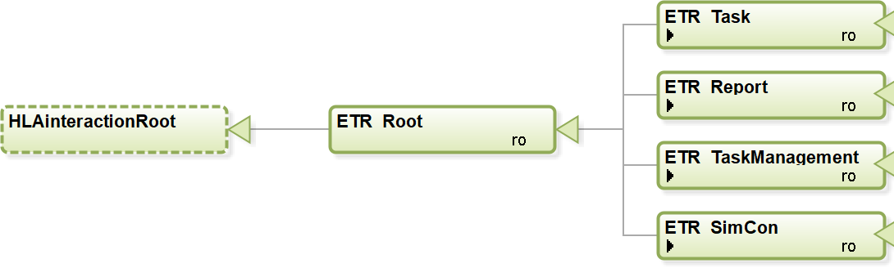
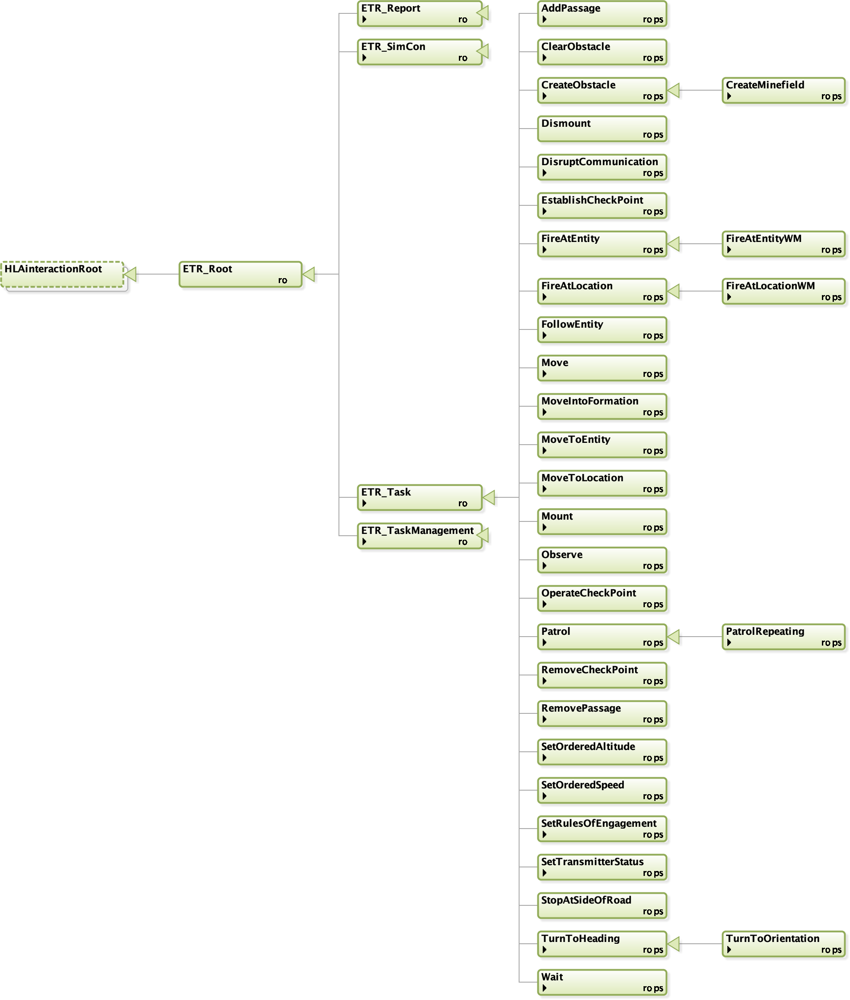
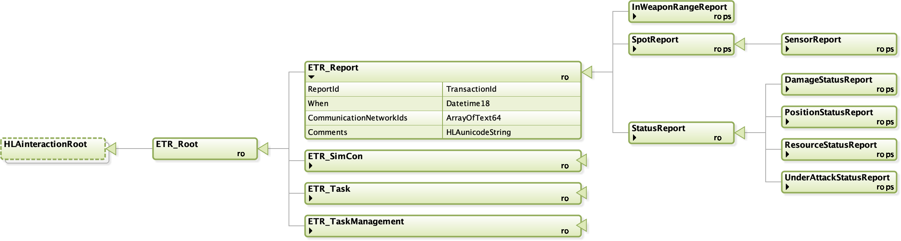
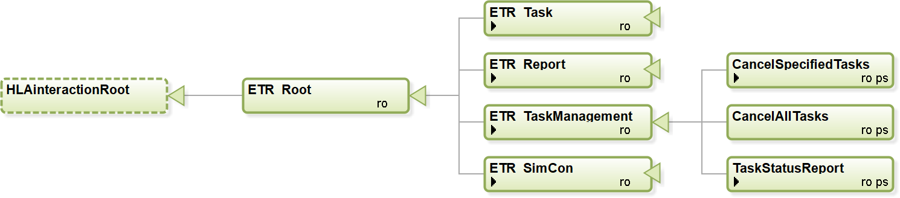
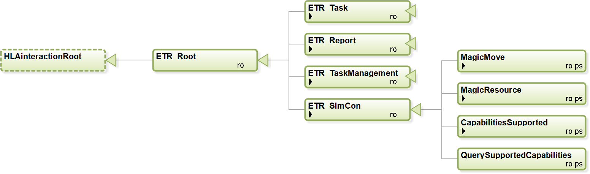
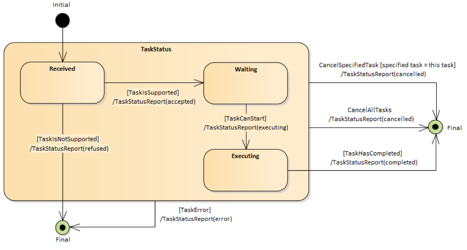

# NETN-ETR

Copyright (C) 2020 NATO/OTAN.
This work is licensed under a [Creative Commons Attribution-NoDerivatives 4.0 International License](LICENCE.md).

## Introduction
This module is a specification of how to represent simulation tasks requests provided to participants in a federated distributed simulation and simulator reports sent during the execution of tasks. The specification is based on IEEE 1516 High Level Architecture (HLA) Object Model Template (OMT) and primarily intended to support interoperability in a federated simulation (federation) based on HLA. An HLA OMT based Federation Object Model (FOM) is used to specify types of data and how it is encoded on the network. The NETN ETR FOM module is available as an XML file for use in HLA based federations.

### Purpose
The NETN ETR module provides a common standard interface for sending tasks to simulated entities represented in a federated distributed simulation. ETR contains common low-level tasks that can easily be interpreted and executed by simulators that model the behaviour of entities. It also defines a set of reports to provide status information, including the status of the tasks being executed by simulated entities.

### Scope
The NETN ETR FOM module is simulation oriented and focuses on tasks with a fine granularity:
* It enables the transformation of command and control messages into tasks that can be executed by a simulator.
* It defines status reports that can be used for producing command and control reports needed for decision making.
* It supports the modelling of simulated command and control interactions between federates in a distributed simulation, for example during an MRM disaggregation process.
* It contains a comprehensive set of tasks and reports that can easily be interpreted and executed by simulators.
* It reflects the capabilities commonly found in COTS Computer Generated Forces (CGF) tools, but it is independent of a specific COTS CGF tool, agent framework, or agent modelling paradigm.
* It is independent of any specific doctrine or tactics.

An entity in ETR can be either a physical entity (e.g. platform or lifeform) or an aggregate entity. If a task or report relates to only a physical entity or to only an aggregate entity, then this is specified in the definition of the task. In the definition of each task, it is not specified how an entity (physical or aggregate) will / should perform the task.

## Overview
The interaction classes are organized in a root class and four base classes: `ETR_Task`, `ETR_Report`, `ETR_TaskManagement`, and `ETR_SimCon`. 

* `ETR_Root`: root interaction class for the Entitiy Tasking and Reporting (ETR) interaction classes.
* `ETR_Task`: A base interaction class for more specialized task interaction classes.
* `ETR_Report`: A base interaction class for more specialized report interaction classes.
* `ETR_TaskManagement`: A base interaction class for more specialized task management interaction classes.
* `ETR_SimCon`: A base interaction class for more specialized Simulation Control (SimCon) interaction classes

### Entity Tasks
This section summarizes the Entity Task interaction classes in the ETR FOM module.

|Task|Description|
|---|---|
|Move|Task entity to move in the specified direction for the given duration.|
|MoveToLocation|Task entity to move to the specified location.|
|MoveToEntity|Task entity to move to another entity.|
|MoveIntoFormation|Task aggregate entity to move into the given formation with the given heading.|
|FollowEntity|Task entity to follow another entity.|
|TurnToHeading|Task entity to turn to the specified heading.|
|Mount|Task entity to mount in the specified entity. The taskee should be within a certain distance tolerance of the entiity to mount into. this tolerance must be specified in the federation agreements. Mount includes: embark (vessel), board (plane), and so on.|
|Dismount|Task entity to dismount from the entity where it is in.|
|FireAtLocation|Task entity to fire at a location.|
|FireAtEntity|Task entity to fire at another specified entity.|
|SetOrderedSpeed|Task entity to set the ordered speed.|
|SetOrderedAltitude|Task entity to set the ordered altitude.|
|Wait|Task entity to wait a defined duration.|
|SetRulesOfEngagement|Task entity to change the rules of engagement.|
|EstablishCheckPoint|Task entity to establish a checkpoint. The task defines a location where a checkpoint shall be established and then operated. |
|OperateCheckPoint| Task entity to operate a checkpoint. The task activates a deactivated check point. |
|StopAtSideOfRoad|Task entity to stop at the side of the road. This task is only relevant for an entity that is moving along a road to a destination. The executing move task is canceled and a new move is defined to a position at the side of the road (the simulator has to calculate this location).|
|RemoveCheckPoint|Task entity to remove a checkpoint. This task removes the checkpoint that is generated in the EstablishCheckpoint task. |
|CreateObstacle|Task entity to create an obstacle with the given geometry. |
|ClearObstacle|Task an entity to clear the obstacle or minefield with the given ID. The taskee entiity should be within a certain distance tolerance (specified in the federation aggrement) of one of the points of the geometry of the obstacle to make the task possible.|
|AddPassage|Task entity to lay/build a passage between the two given points. The passage can for example be a passage through an obstacle or a bridge over a river. The taskee entiity should be within a certain distance tolerance (specified in the federation aggrement) of one of the points of the passage to make the task possible. |
|RemovePassage|Task entity to remove the pasasage with the given ID. The taskee entiity should be within a certain distance tolerance (specified in the federation aggrement) of one of the points of the passage to make the task possible.|
|Patrol|Task entity to perform a patrol. The patrol covers the path from the current location to the start point of the patrol route, and the patrol route itself. The patrol route shall be followed from start to end. The entity behaviour at the end point depends on the patrol type.|
|SetTransmitterStatus|Task entity to switch on/off all of its transmitters.|
|Observe|Task entity to observe an area with sensors. |
|JamCommunication|Task entity to jam a communication network in a specified area.|

### Entity Reports
This section summarizes the Entity Report interaction classes in the ETR FOM module, shown in the figure below.

|Report|Description|
|---|---|
|StatusReport|Status report from an entity about its own (perceived) state. This report is generated with a certain frequency specified in the federation agreements.|
|SpotReport|Spot reports are reports used by all entities to transmit intelligence or information about a spotted enemy, neutral, or unknown entity.|
|InWeaponRangeReport|The entities that are in range of a specific weapon.|

### Task Management
This section summarizes the Task Management interaction classes in the ETR FOM module, shown in the figure below.

|Task Management|Description|
|---|---|
|CancelSpecifiedTasks|Cancel all specified tasks. Tasks already started are also cancelled.|
|CancelAllTasks|Cancel all tasks. Tasks already started are also cancelled.|
|TaskStatusReport|A report about the status of a task given to an entity. The status of the task defined by the TaskId can be: Accepted, Refused, Cancelled, Executing, Completed or Error.|
|QueryCapabilitiesSupported|Query an entity which tasks and reports it supports. The taskee shall respond with a CapabilitiesSupported message.|
|CapabilitiesSupported|Provide the set of tasks and reports that the entity supports. This interaction is in response to a QueryCapabilitiesSupported, using the same Taskee and Tasker.|

### Simulation Control
This section summarizes the Simulation Control interaction classes in the ETR FOM module, shown in the figure below.

|Simulation Control|Description|
|---|---|
|MagicMove|Place the entity to the specified location with a given heading. All given task of the entity are cancelled.|
|MagicResource|Changes the resource amount of the entity.|

## ETR Task Processing

The following sections define how tasks shall be handled.

### ETR Task Modes

The ETR FOM module defines two modes for a task: non-concurrent mode and concurrent mode.

In the non-concurrent mode the task is placed on the non-concurrent task list for the entity, which serves as a waiting list. Once the task is at the head of the task list, and the currently executing task completes, it is removed from the non-concurrent task list and started. Using this task mode, tasks are executed one after the other.

In the concurrent mode the task is placed on the concurrent task list for the entity. This list also serves as a waiting list. Once the task is at the head of the task list and it can execute concurrently with already executing tasks, it is removed from the task list and started.

When no task is executed the task at the head of the non-concurrent task list has a higher priority to start then the task at the head of the concurrent task list.

### ETR Task States

The following states are defined for a task:

* TaskStatus.Received: the task is received;
* TaskStatus.Waiting: the task is waiting for execution;
* TaskStatus.Executing: the task is executing.

The task state diagram is shown below.

#### Received State
A task in the Received state shall be handled in the following way:

1. Determine if the task is supported. The determination is made by the federate application in accordance with [Entity Task and Reporting Capabilities](#Entity-Task-and-Reporting-Capabilities).
2. If the task is not supported then
    * A `TaskStatusReport` (refused) shall be returned to the Tasker.
    * The task is removed.
3. Else
    * The task shall be placed in either the non-concurrent task list or the concurrent task list depending on the task mode, in accordance with [Task List Ordering](#Task-List-Ordering).
    * A `TaskStatusReport` (accepted) shall be returned to the Tasker.
    * The task shall transition to the Waiting state.

#### Waiting State
A task in the Waiting state shall be handled in the following way:
1.	Determine if the task can start using the following conditions:
    * For a non-concurrent mode task:
        * The task is at head of the non-concurrent task list, and
        * The task’s taskee is not executing a task, and
        * The task has no `StartWhen` time (i.e. the StartWhen is undefined), or the task has a StartWhen time and this time is less than or equal to the current time.
    * For a concurrent mode task:
        * The task is at the head of the concurrent task list and
        * The task has no `StartWhen` time (i.e. the StartWhen is undefined), or the task has a StartWhen time and this time is less than or equal to the current time, and
        * The task does not conflict with other executing tasks, see [Concurrent Tasks](#Concurrent-Tasks).
2.	If the task can start then
    - The task shall be removed from the task list.
    - A `TaskStatusReport` (executing) shall be returned to the Tasker.
    - The task shall transition to the Executing state.
3.	Else
    * The task shall remain in the Waiting state, even if the current time has passed the time specified in the `StartWhen` parameter of the task.

#### Executing State
A task in the Executing state shall be handled in the following way:

1.	Determine if the task has completed. The conditions are scenario specific and the determination is up to the federate application.
2.	If the task has completed then
    * A `TaskStatusReport` (completed) shall be returned to the Tasker.
    * The task is removed.
3.	Else
    * The task shall remain in the Executing state.

#### TaskStatus State
A task in the TaskStatus state shall be handled as specified in the sub states, and also in the following way:

1.	If the task is cancelled by either a `CancelAllTasks` or `CancelSpecifiedTask` then
    * A `TaskStatusReport` (cancelled) shall be returned to the Tasker.
    * The task is removed.
2.	If the task cannot be handled due to an internal federate application error then
    * A `TaskStatusReport` (error) shall be returned to the Tasker and a description of the error shall be included in the message.
    * The task is removed.

### Task List Ordering

Each entity has a non-concurrent task list for tasks in non-concurrent mode and a concurrent task list for tasks in concurrent mode. The task at the head of the non-concurrent task list is the first task to be started once all currently executing tasks are completed. The task at the head of the concurrent task list is the first task to be started when it can run concurrently with all executing tasks or when all currently executing tasks are completed. The ordering of the tasks in both  list shall be according to the following figure.

The tasklist shall be divided in two parts: a left part that contains tasks where the StartWhen is specified, and a right part that contains tasks where no StartWhen is specified. The division point shall mark the head of the left part and the tail of the right part. A part is empty if there are no tasks for that part.

A task shall be placed in the task list as follows:

1.	If the StartWhen time of the task is specified then the task shall be placed in the left part of the task list, using the StartWhen time to order the tasks in this part (with decreasing StartWhen value towards the head of the list).
2.	If the StartWhen time of the task is not specified then the task shall be placed at the tail of the right part of the task list.

###	Concurrent Tasks

In order to define which tasks can run concurrently, we divide the tasks in four task groups:

| Movement group    | Weapon group     | SetAction group      | Single group |
| ----------------- | ---------------- | -------------------- | ------------ |
| Move              | FireAtLocation   | SetOrderedSpeed      | Mount              |
| MoveToLocation    | FireAtLocationWM | SetOrderedAltitude   | Dismount             |
| MoveToEntity      | FireAtEntity     | SetRulesOfEngagement | EstablishCheckPoint             |
| MoveIntoFormation | FireAtEntityWM   | SetTransmitterStatus | OperateCheckPoint             |
| FollowEntity      |                  | JamCommunication | RemoveCheckPoint             |
| TurnToHeading     |                  |                      |  CreateObstacle            |
| TurnToOrientation |                  |                      | CreateMinefield             |
| Wait              |                  |                      |   ClearObstacle           |
| Patrol            |                  |                      | AddPassage             |
| PatrolRepeating   |                  |                      | RemovePassage             |
| StopAtSideOfRoad  |                  |                      |              |
| Observe | | | |

There are the following restrictions regarding concurrency:

1. Movement group:
   1. Only one task in this group can be executed at the same time.
   2. A task in this group can run together with a task in the Weapon or SetAction group.

2. Weapon group:
   1. Only one task in this group can be executed at the same time.
   2. A task in this group can run together with a task in the Movement or SetAction group.

3. SetAction group:
   1. Multiple tasks in this group can be executed at the same time.
   2. A task in this group can run together with a task in the Movement or Weapon group.

4. Single group:
   1. Only one task in this group can be executed at the same time.
   2. A task in this group can not run together with a task in another group.

So, several tasks can be executed at the same time. For example a Patrol, SetOrderedSpeed and FireAtEntity; or a MoveToLocation, SetOrderedAltitude and FireAtLocation. A FireAtEntity task can be timed while executing a MoveToLocation task by using the StartWhen time. It is also possible to change the speed or altitiude after a certain time during a movement by using the StartWhen time for the SetOrderedSpeed or SetOrderedAltitude task.

## ETR Task Management Tasks

### Entity Task and Reporting Capabilities

It shall be possible to query an entity for the ETR tasks and ETR reports that it supports. The set of tasks and reports that an entity supports is implementation-specific, and shall be used in the Received state of a task to determine if the task is supported.

With the interaction class `QueryCapabilitiesSupported` an entity can be queried for the supported ETR tasks and ETR reports. The result is provided via the interaction class `CapabilitiesSupported`.

## ETR Simulation Control Tasks
A Simulation Control task for an entity shall be executed immediately, regardless of the presence of any (concurrent or non-concurrent) executing task.

### Magic Move
A `MagicMove` for an entity shall implicitly cancel all tasks for the entity. A TaskStatusReport (cancelled) shall be issued for each task in accordance with the task state diagram.

### Magic Resources
A `MagicResource` shall update the entity resources. Waiting or executing tasks of the entity are affected in the sense that these tasks have more or less resources available after the MagicResource.

## Implementation Requirements
This section lists the requirements for applications that implement Entity Tasking and Reporting. The requirements are provided from receiver point of view (entity taskee, the federate application modelling the entity) and sender point of view (entity tasker, the federate application sending a task or receiving a report for an entity).

The receiver:
1.	SHALL support all ETR TaskManagement and ETR SimCon classes.
2.	MAY support a subset of the ETR Task and ETR Report classes.
3.	SHALL provide all interaction class parameters when sending an ETR interaction.

The sender:
1.	SHALL provide all interaction class parameters when sending an ETR interaction.

In addition, for the receiver, the following SHALL be documented in the federation agreements:
1.	Distance tolerances of supported tasks (for the tasks `Mount`, `EstablishCheckPoint`, `OperateCheckPoint`, `RemoveCheckPoint`, `CreateObstacle`, `ClearObstacle`, `CreateMinefield`, `AddPassage`, and `RemovePassage`).
2.	Entities that provide ETR Reports.
3.	Time frequencies and conditions for the supported ETR Reports.
4.	Modelling agreements related to checkpoints (if supported, see `EstablishCheckPoint`, `OperateCheckPoint`, and `RemoveCheckPoint`).
5.	Modeling agreements related to minefields (if supported, see `CreateMineField`).
