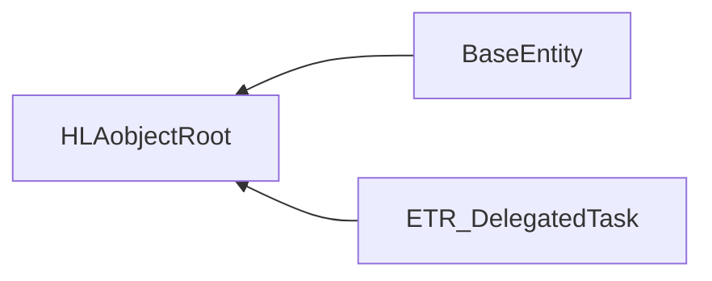
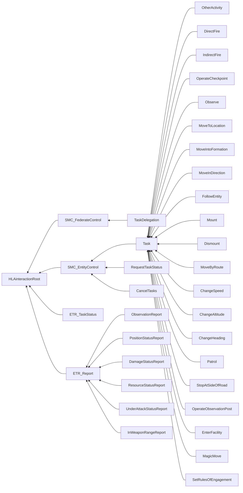

# NETN-ETR
|Version| Date| Dependencies|
|---|---|---|
|3.0 |2023-11-19|NETN-BASE, NETN-SMC|

The NETN-ETR FOM module provides a standard interface for sending tasks to simulated entities represented in a federated distributed simulation.

The NATO Education and Training Network (NETN) Entity Tasking and Reports (ETR) Module defines interactions that can be interpreted and executed by simulators that model the behaviour of a tasked entity. The module also defines reports sent by simulated entities.

The module defines the pattern for tasking simulated entities and provides a core set of tasks. Other NETN modules define additional tasks. Provided task definitions reflects the capabilities commonly found in COTS Computer Generated Forces (CGF) applications but are independent of a specific CGF, agent framework, or agent modelling paradigm. 
            
A tasked entity can be either a physical entity (e.g. platform or lifeform) or an aggregate entity. The task definition itself does not specify how a simulation models the execution of the task.

## Overview 
The NETN-ETR module extends the RPR-FOM object class `BaseEntity` with optional attributes related to tasking. 
These include a list of what tasks are supported, previous, planned, current, and progress of ongoing tasks. 
 
 
Tasking and reporting use the following base interaction classes: 
 
* `Task` is a subclass of the NETN-SMC `SMC_EntityControl` class for sending control actions to a federate modelling a referenced entity. The `Task` interaction class is the base class for all tasks defined in NETN-ETR and other modules. 
* `ETR_Report` is a base class for reports generated by entities. 
 
### Tasks 
 
Entity tasking uses the standard `SMC_EntityControl` Request-Response pattern. 
 
* A TaskingFederate sends a `Taks` interaction with task parameters to an EntityFederate. 
* If the task is accepted, the receiving EntityFederate sends a `SMC_Respose` indicating success. 
* During the execution of the task, the EntityFederate sends `ETR_TaskStatus` to notify of any change in the task execution status. 
 
The `ETR_TaskStatus` interaction provides the following notifications regarding the task: 
 
* Accepted: the task is received and scheduled for execution 
* Refused: the task is not accepted for execution 
* Waiting: the task is waiting for execution 
* Executing: the task is running 
* Completed: the task has been executed successfully 
* Cancelled: the task execution has been explicitly terminated 
* Error: the task execution has been terminated due to a modelling error 
 
 
A task can be executed concurrently with other tasks or sequentially. The task parameters indicate the expected mode of task execution. Tasks are scheduled based on their start time and task execution mode. 
 
The execution of a task can start if: 
 
* For a non-concurrent task 
* No other non-concurrent task is executing 
* The task has the earliest `StartTime` parameter of all planned non-concurrent tasks 
* The task parameter `StartTime` is less than or equal to the current `ScenarioTime`. 
* For a concurrent task 
* The task parameter `StartTime` is less than or equal to the current `ScenarioTime`. 
 
Scheduled tasks are published using the `PlannedTasks` attribute of the simulated entity. 
 
Currently executing tasks and their execution progress are published using the simulated entity's `CurrentTasks` and `TaskProgress` attributes. 
 
Completed tasks are published using the `PreviousTasks` attribute of the simulated entity. 
 
Use the NETN-SMC `BaseEntity` attribute `SupportedActions` to indicate which tasks are supported. Normally, a TaskingFederate check supported tasks before sending a `Task`.

## Object Classes

Note that inherited and dependency attributes are not included in the description of object classes.

### BaseEntity

A base class of aggregate and discrete scenario domain participants. The BaseEntity class is characterized by being located at a particular location in space and independently movable, if capable of movement at all. It specifically excludes elements normally considered to be a component of another element. The BaseEntity class is intended to be a container for common attributes for entities of this type. Since it lacks sufficient class specific attributes that are required for simulation purposes, federates cannot publish objects of this class. Certain simulation management federates, e.g. viewers, may subscribe to this class. Simulation federates will normally subscribe to one of the subclasses, to gain the extra information required to properly simulate the entity.

|Attribute|Datatype|Semantics|
|---|---|---|
|CurrentTasks|ArrayOfTaskDefinitions|Optional. An array of currently executing tasks.|
|TaskProgress|ArrayOfTaskProgress|Optional. An array of progress for current tasks.|
|PlannedTasks|ArrayOfTaskDefinitions|Optional. An array of all planned tasks.|
|PreviousTasks|ArrayOfTaskDefinitions|Optional. An array of completed or cancelled tasks.|

### ETR_DelegatedTask

Object to represent a task and its execution progress when delegated to a federate application other than the one responsible for the tasked entity.

|Attribute|Datatype|Semantics|
|---|---|---|
|TaskDefinition|TaskDefinition|Required. Definition description of the task represented.|
|TaskProgress|TaskProgress|Required. Progress description of the task represented.|

## Interaction Classes

Note that inherited and dependency parameters are not included in the description of interaction classes.

### SMC_FederateControl

### TaskDelegation

Request a specific federate application to execute a task. If the delegated task is accepted, a `DelegatedTask` object is created in the federation to track the progress of task execution.

|Parameter|Datatype|Semantics|
|---|---|---|
|TaskDefinition|TaskDefinition|Required. Definition of the task.|
|Entity|UUID|Required: The entity to perform the task.|

### SMC_EntityControl

### Task

Requests a simulated entity to perform some task based on a task description. If accepted, the federate application modelling the behaviour will execute the task per task parameters and scheduling. A request task is acknowledged using a `TaskStatusUpdate` response interaction. Resending a `RequestTask` with the same `TaskId` as a previously sent interaction is equivalent to cancelling and sending a new task.

|Parameter|Datatype|Semantics|
|---|---|---|
|TaskId|UUID|Required. Unique identifier for the task.|
|StartTime|EpochTime|Optional. The default value is the current `ScenarioTime`.|
|Activity|AggregateMissionEnum16|Optional. Specifies the activity for the entity that will execute the task. The default value is zero (0).|
|Annotation|HLAunicodeString|Optional. A general text describing information about this task. The annotation may, e.g. include the reason for the task and text describing the names of referenced entities.|
|MainTask|UUID|Optional. Provided to indicate that this task is a subtask related to a main task.|
|PreviousTask|UUID|Optional. Provided to indicate that the task will execute after the referenced task.|
|NextTask|UUID|Optional. Provided to indicate that the task will execute before the referenced task.|
|Tasker|UUID|Optional. Reference to the commander of the task. If missing, the commander is undefined.|
|TaskMode|TaskModeEnum8|Optional. Determines the task mode. Default NonConcurrentMode|

### OtherActivity

Tasking of an entity to wait for a duration of time.

|Parameter|Datatype|Semantics|
|---|---|---|
|TaskParameters|OtherActivityTaskStruct|Required: Task parameters.|

### DirectFire

Tasking an entity to fire directed at a specified target entity.

|Parameter|Datatype|Semantics|
|---|---|---|
|TaskParameters|DirectFireTaskStruct|Required: Task parameters|

### IndirectFire

Tasking an entity to fire directed at an area.

|Parameter|Datatype|Semantics|
|---|---|---|
|TaskParameters|IndirectFireTaskStruct|Required: Task parameters|

### OperateCheckpoint

Request an entity to operate a checkpoint. The tasked entity should be within the radius of the checkpoint object. If not, a separate move task should be issued first. The tasked entity activates an inactive checkpoint and operates the checkpoint for the specified duration.

|Parameter|Datatype|Semantics|
|---|---|---|
|TaskParameters|OperateCheckpointTaskStruct|Required: Task parameters|

### Observe

Tasking of an entity to observe an area.

|Parameter|Datatype|Semantics|
|---|---|---|
|TaskParameters|ObserveTaskStruct|Required: Task parameters|

### MoveToLocation

Request a simulated entity to move to a specified destination location. The entity aligns with the path from its current position to the nearest position or waypoint on the path. The entity leaves the path at a position or waypoint on the path closest to the destination.

|Parameter|Datatype|Semantics|
|---|---|---|
|TaskParameters|MoveToLocationTaskStruct|Required: Task parameters.|

### MoveIntoFormation

Tasking a simulated entity to move into the given formation on the given location with the given heading.

|Parameter|Datatype|Semantics|
|---|---|---|
|TaskParameters|MoveIntoFormationTaskStruct|Required: Task parameters.|

### MoveInDirection

Tasking of an entity to move in a specified direction for a duration.

|Parameter|Datatype|Semantics|
|---|---|---|
|TaskParameters|MoveInDirectionTaskStruct|Required: Task parameters.|

### FollowEntity

Tasking of an entity to follow another entity at a specified distance.

|Parameter|Datatype|Semantics|
|---|---|---|
|TaskParameters|FollowEntityTaskStruct|Required: Task parameters.|

### Mount

Requesting a simulated entity to mount the specified entity. The tasked entity should be within a certain distance (tolerance specified in the federation agreements) of the entity's location to mount.

|Parameter|Datatype|Semantics|
|---|---|---|
|TaskParameters|AttachTaskStruct|Required: Task parameters|

### Dismount

Requesting a simulated entity to dismount from a mounted position.

### MoveByRoute

Requesting a simulated entity to move given the specified route with a given speed for reaching each waypoint. The entity should align with the path from its current position to the first waypoint on the path using the speed set for the first waypoint in the route. When reaching the last waypoint, the speed is zero (0), and movement stops.

|Parameter|Datatype|Semantics|
|---|---|---|
|TaskParameters|MoveByRouteTaskStruct|Required: Task parameters.|

### ChangeSpeed

Tasking of an entity to change speed.

|Parameter|Datatype|Semantics|
|---|---|---|
|TaskParameters|ChangeSpeedTaskStruct|Required: Task parameters.|

### ChangeAltitude

Tasking of an entity to set move to a specified altitude.

|Parameter|Datatype|Semantics|
|---|---|---|
|TaskParameters|ChangeAltitudeTaskStruct|Required: Task parameters.|

### ChangeHeading

Tasking of an entity to change heading.

|Parameter|Datatype|Semantics|
|---|---|---|
|TaskParameters|ChangeHeadingTaskStruct|Required: Task parameters.|

### Patrol

Requesting a simulated entity to perform a patrol task. The tasked entity moves from its current position to the start of the patrol route and then moves according to the patrol route from its start point in the path through all waypoints.

|Parameter|Datatype|Semantics|
|---|---|---|
|TaskParameters|PatrolTaskStruct|Required: Task parameters|

### StopAtSideOfRoad

Requesting a simulated entity to stop at the side of the road. This task is only relevant for an entity moving along a road. The current move task is cancelled, and a new move task executes to a position at the side of the road (the simulator has to calculate this location).

### OperateObservationPost

Requests an entity to operate an observation post. The tasked unit should be within in a given radius from the observation post. If not, a separate move task should be issued first. The tasked unit activates an inactive observation post and operates it for the specified duration.

|Parameter|Datatype|Semantics|
|---|---|---|
|TaskParameters|OperateObservationPostTaskStruct|Required: Task parameters|

### EnterFacility

Requesting a simulated entity to enter the specified facility (cultural feature). The tasked entity should be within a certain distance (tolerance specified in the federation agreements) of the facility location to enter.

|Parameter|Datatype|Semantics|
|---|---|---|
|TaskParameters|AttachTaskStruct|Required: Task parameters|

### MagicMove

Instructs the simulation entity to immediately change location to the specified position and heading.

|Parameter|Datatype|Semantics|
|---|---|---|
|Location|LocationStruct|Required. Location of the entity.|
|Heading|DirectionDegreesFloat32|Optional. Heading of the entity. [0,360). Default = 0. True North.|

### SetRulesOfEngagement

Instructs the simulation entity to change its rules of engagement immediately.

|Parameter|Datatype|Semantics|
|---|---|---|
|RulesOfEngagement|RulesOfEngagementEnum8|Required. The rules of engagement for an entity.|

### RequestTaskStatus

Requests the federate application modelling the tasked entity to send a `TaskStatusUpdate` interaction for the specified tasks.

|Parameter|Datatype|Semantics|
|---|---|---|
|Tasks|ArrayOfUuid|Optional. Tasks for which status reports are requested. The default, if not provided or if the list of tasks is empty, the request refers to all tasks for the tasked entity.|

### CancelTasks

Request to cancel all one or more tasks.

|Parameter|Datatype|Semantics|
|---|---|---|
|Tasks|ArrayOfUuid|Required. Tasks to cancel. If no specific tasks are indicated, the default is to cancel all scheduled and ongoing tasks for the simulation entity.|

### ETR_TaskStatus

A management task report regarding the status of a specific task assigned to an entity. The inherited parameter `Time is required.`

|Parameter|Datatype|Semantics|
|---|---|---|
|Task|UUID|Required. Reference to the task associated with the report.|
|TaskStatus|TaskStatusEnum32|Required. The status of the task.|

### ETR_Report

A base interaction class for more specialized report interaction classes. The inherited parameter `Time is required.`

|Parameter|Datatype|Semantics|
|---|---|---|
|ReportId|UUID|Required: Unique identifier for the report itself.|
|ReportingEntity|UUID|Required: The entity sending the report.|
|Receiver|UUID|Optional: The indended receiver of the message if directed to a specific unit or simulated entity. If not provided, the report is modeled as broadcasted on the entity's default C2 or Battle Management System network.|
|TimeStamp|EpochTime|Required: The timestamp of the report in Scenario Time.|
|Comments|HLAunicodeString|Optional. Any additional comments associated with the report.|

### ObservationReport

Report on a unit's observation of a simulated entity. Based on SISO C2SIM standard ontology for representation of Observation Reports.

|Parameter|Datatype|Semantics|
|---|---|---|
|ObservedEntity|UUID|Required: The unique identifier of the observed entity|
|IdentificationLevel|IdentificationLevelEnum8|Optional. The identification level of spotted entities.|
|ConfidenceLevel|Float64|Optional:|
|SensorType|EntityTypeStruct|Optional: The type of sensor that is the primary source of the report.|
|UncertaintyInterval|Float64|Optional|
|Activity|AggregateMissionEnum16|Optional: The current activity of the entity. (Fromm NETN-Base)  Default value: Moving (213)|
|Health|PercentFloat32|Optional: Observed strength of an entity expressed as a percentage of the perceived normal strength.|
|Location|LocationStruct|Optional: Observed location where the entity were spotted|
|Heading|DirectionDegreesFloat32|Optional: Observed heading of spotted entity.|
|Speed|VelocityMeterPerSecondFloat32|Optional: Observed speed of the entity (m/s).|
|HostilityStatus|HostilityStatusCodeEnum32|Optional: Perceived hostility of the observed entity.|
|Marking|HLAunicodeString|Optional: Observed marking on the entity.|
|Name|HLAunicodeString|Optional: Perceived name of the observed entity.|
|Side|UUID|Optional: Perceived force identifier of the observed entity.|
|Equipment|ArrayOfObservedEquipment|Optional: Observed supplies and equipment.|
|Symbol|SymbolIdentifier|Optional: Symbol identifier for the entity.|

### PositionStatusReport

Report on an entity's own position, speed, and heading.

|Parameter|Datatype|Semantics|
|---|---|---|
|Position|LocationStruct|Required. Position of the entity at the specified time.|
|Heading|DirectionDegreesFloat32|Required. Heading of the entity. [0,360). Default = 0. True North.|
|Speed|VelocityMeterPerSecondFloat32|Required. Speed of the entity.|

### DamageStatusReport

Report on a unit's damage status.

|Parameter|Datatype|Semantics|
|---|---|---|
|DamageType|DamageStatusEnhancedEnum32|Required. Damage state of the reported entity.|

### ResourceStatusReport

Report on a unit's remaining amount of resources.

|Parameter|Datatype|Semantics|
|---|---|---|
|Resource|SupplyStatusStruct|Required. The type of resource and remaining quantity.|

### UnderAttackStatusReport

Report from a unit that it is under attack.

|Parameter|Datatype|Semantics|
|---|---|---|
|FromDirection|DirectionDegreesFloat32|Required. The direction to the attacking entity [0,360). Default = 0. True North.|
|Severeness|AttackTypeEnum32|Required. Severeness of the attack upon the reporting entity.|

### InWeaponRangeReport

Report on a unit's ability to reach specific targets with its weapon systems.

|Parameter|Datatype|Semantics|
|---|---|---|
|WeaponType|EntityTypeStruct|Required. The type of weapon that is in range.|
|EntitiesInWeaponRange|ArrayOfUuid|Required. Reference to entities in weapon range.|

## Datatypes

Note that only datatypes defined in this FOM Module are listed below. Please refer to FOM Modules on which this module depends for other referenced datatypes.

### Overview
|Name|Semantics|
|---|---|
|ArrayOfObservedEquipment|An array with spotted equipment at the spotted entity.|
|ArrayOfTaskDefinitions|Array containing task definitions.|
|ArrayOfTaskProgress|Array of task progress types.|
|ArrayOfWaypoints|Array of waypoints with location and the speed to the waypoint.|
|AttachTaskStruct|Task-specific data for tasks related to attach or associate one entity with another, e.g. mount a platform, embark on a ship, or to enter a facility.|
|AttackTypeEnum32|The kind of attack by the enemy.|
|ChangeAltitudeTaskStruct|Task-specific data for ChangeAltitude|
|ChangeHeadingTaskStruct|Task-specific data to turn to the specified heading.|
|ChangeSpeedTaskStruct|Task-specific data for ChangeSpeedTask task.|
|DirectFireTaskStruct|Task-specific data for direct fire.|
|ElapsedTimeProgress|Progress definition for tasks only needing elapsed time.|
|EmptyTaskStruct|No task parameters.|
|EntityControlActionEnum|Control actions for entities.|
|FederateControlActionEnum|SMC Control action enumeration.|
|FireTaskProgress|Task progress data for Fire tasks.|
|FollowEntityTaskStruct|Task-specific data for FollowEntity|
|IdentificationLevelEnum8|The identification level of an object.|
|IndirectFireTaskStruct|Task-specific data for IndirectFire task.|
|MoveByRouteTaskStruct|Task-specific data for MoveByRoute.|
|MoveInDirectionTaskStruct|Tasking of an entity to move in a specified direction for a given duration.|
|MoveIntoFormationTaskStruct|Initial movement speed.|
|MoveTaskProgress|Task progress data for all move tasks with a path. If the next waypoint index < the last waypoint index, it indicates the reverse movement along a route.|
|MoveToEntityTaskStruct|Task-specific data for MoveToEntity.|
|MoveToLocationTaskStruct|Task-specific data for MoveToLocation task.|
|MoveTypeEnum32|CrossCountry: move directly to the destination without considering the roads. OnlyRoads: stay on the roads to get to the closest point to the destination that is still on the road; if there is no road very near to the start (within around 10 meters), there will be no movement. RoadsAndCrossCountry: move to the destination by considering the roads; it is allowed to go off the road.|
|ObserveTaskStruct|Task-specific data for Observe task.|
|ObservedEquipment|Equipment at the observed entity.|
|OperateCheckpointTaskStruct|Task-specific data for OperateCheckpoint task.|
|OperateObservationPostTaskStruct|Task-specific data for OperateObservationPost task.|
|OtherActivityTaskStruct|Task-specific data for this task.|
|PatrolMoveTypeEnum32|Defines the movement during the execution of the patrol.|
|PatrolTaskProgress|Task progress data for PatrolRepeating tasks.|
|PatrolTaskStruct|Task-specific data for a Patrol task.|
|PatrolTypeEnum32|Other - The behaviour is federate application specific (e.g. wait for the next command). Circle - At the end of the route, move to the start point of the patrol route (the federate application determines the route). Reverse - Follow the patrol route in reverse order.|
|RoundStruct|Details of munition fired.|
|RulesOfEngagementEnum8|Rules of engagement for a simulated entity.|
|TaskDefinition|Fixed record to describe the definition of a task.|
|TaskDefinitionVariantRecord|Variant record for task definition data.|
|TaskModeEnum8|Specifies if task execution is in non-concurrent or concurrent mode.|
|TaskProgress|Fixed record to describe the progress of an executing task.|
|TaskProgressVariantRecord|Variant record for task progress data.|
|TaskStatusEnum32|The status of a task.|
|Waypoint|A location and the speed to reach that location.|
        
### Enumerated Datatypes
|Name|Representation|Semantics|
|---|---|---|
|AttackTypeEnum32|HLAinteger32BE|The kind of attack by the enemy.|
|EntityControlActionEnum|HLAinteger32BE|Control actions for entities.|
|FederateControlActionEnum|HLAinteger32BE|SMC Control action enumeration.|
|IdentificationLevelEnum8|HLAoctet|The identification level of an object.|
|MoveTypeEnum32|HLAinteger32BE|CrossCountry: move directly to the destination without considering the roads. OnlyRoads: stay on the roads to get to the closest point to the destination that is still on the road; if there is no road very near to the start (within around 10 meters), there will be no movement. RoadsAndCrossCountry: move to the destination by considering the roads; it is allowed to go off the road.|
|PatrolMoveTypeEnum32|HLAinteger32BE|Defines the movement during the execution of the patrol.|
|PatrolTypeEnum32|HLAinteger32BE|Other - The behaviour is federate application specific (e.g. wait for the next command). Circle - At the end of the route, move to the start point of the patrol route (the federate application determines the route). Reverse - Follow the patrol route in reverse order.|
|RulesOfEngagementEnum8|HLAoctet|Rules of engagement for a simulated entity.|
|TaskModeEnum8|HLAoctet|Specifies if task execution is in non-concurrent or concurrent mode.|
|TaskStatusEnum32|HLAinteger32BE|The status of a task.|
        
### Array Datatypes
|Name|Element Datatype|Semantics|
|---|---|---|
|ArrayOfObservedEquipment|ObservedEquipment|An array with spotted equipment at the spotted entity.|
|ArrayOfTaskDefinitions|TaskDefinition|Array containing task definitions.|
|ArrayOfTaskProgress|TaskProgress|Array of task progress types.|
|ArrayOfWaypoints|Waypoint|Array of waypoints with location and the speed to the waypoint.|
        
### Fixed Record Datatypes
|Name|Fields|Semantics|
|---|---|---|
|AttachTaskStruct|EntityId|Task-specific data for tasks related to attach or associate one entity with another, e.g. mount a platform, embark on a ship, or to enter a facility.|
|ChangeAltitudeTaskStruct|Altitude|Task-specific data for ChangeAltitude|
|ChangeHeadingTaskStruct|Heading|Task-specific data to turn to the specified heading.|
|ChangeSpeedTaskStruct|Speed|Task-specific data for ChangeSpeedTask task.|
|DirectFireTaskStruct|Target, Duration, Round|Task-specific data for direct fire.|
|ElapsedTimeProgress|ElapsedTime|Progress definition for tasks only needing elapsed time.|
|EmptyTaskStruct||No task parameters.|
|FireTaskProgress|ElapsedTime, MunitionUsed|Task progress data for Fire tasks.|
|FollowEntityTaskStruct|FollowedEntity, Behind, Right, Above, Duration|Task-specific data for FollowEntity|
|IndirectFireTaskStruct|Area, Duration, Round|Task-specific data for IndirectFire task.|
|MoveByRouteTaskStruct|Route, MoveType|Task-specific data for MoveByRoute.|
|MoveInDirectionTaskStruct|Direction, Speed, Duration|Tasking of an entity to move in a specified direction for a given duration.|
|MoveIntoFormationTaskStruct|Formation, Location, Distance, Heading, Speed|Initial movement speed.|
|MoveTaskProgress|LastPassedWaypointIndex, NextWaypointIndex|Task progress data for all move tasks with a path. If the next waypoint index < the last waypoint index, it indicates the reverse movement along a route.|
|MoveToEntityTaskStruct|Entity, Path, MoveType|Task-specific data for MoveToEntity.|
|MoveToLocationTaskStruct|Location, Path, MoveType, Speed|Task-specific data for MoveToLocation task.|
|ObserveTaskStruct|ObservationArea|Task-specific data for Observe task.|
|ObservedEquipment|Type, NumberOfEquipment|Equipment at the observed entity.|
|OperateCheckpointTaskStruct|CheckpointId, Duration, DelayTime|Task-specific data for OperateCheckpoint task.|
|OperateObservationPostTaskStruct|ObserveTask, Duration, ObservationPostId|Task-specific data for OperateObservationPost task.|
|OtherActivityTaskStruct|Duration|Task-specific data for this task.|
|PatrolTaskProgress|PathProgress, ElapsedTime, IntervalElapsedTime|Task progress data for PatrolRepeating tasks.|
|PatrolTaskStruct|Path, PatrolType, MoveType, Duration, IntervalTime|Task-specific data for a Patrol task.|
|RoundStruct|WeaponType, MunitionType, QuantityFired, RateOfFire|Details of munition fired.|
|TaskDefinition|TaskId, TaskedEntity, Tasker, StartTime, Annotation, TaskMode, Activity, Status, TaskParameters, MainTask, PreviousTask, NextTask|Fixed record to describe the definition of a task.|
|TaskProgress|TaskId, LastUpdated, ExecutingFederateId, ETC, ProgressData|Fixed record to describe the progress of an executing task.|
|Waypoint|Location, Speed|A location and the speed to reach that location.|
        
### Variant Record Datatypes
|Name|Discriminant (Datatype)|Alternatives|Semantics|
|---|---|---|---|
|TaskDefinitionVariantRecord|TaskType (EntityControlActionEnum)|NoTaskParameters, DirectFire, IndirectFire, FollowEntity, MoveInDirection, MoveIntoFormation, MoveToEntity, MoveToLocation, Attach, Observe, OperateCheckpoint, Patrol, ChangeAltitude, ChangeSpeed, ChangeHeading, OtherActivity, OperateObservationPost|Variant record for task definition data.|
|TaskProgressVariantRecord|TaskType (EntityControlActionEnum)|ElapsedTime, FireTask, MoveOnPath, Patrol|Variant record for task progress data.|
    