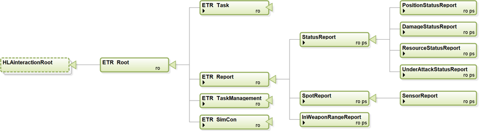
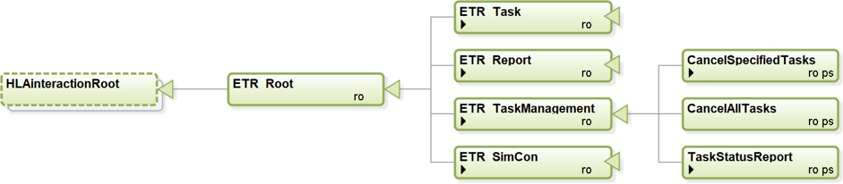
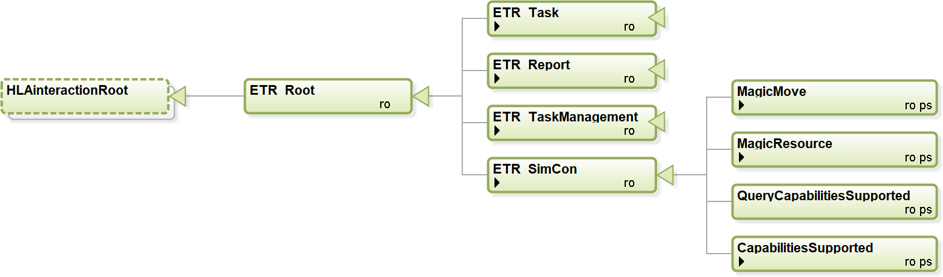

## Entity Tasks

This section summarizes the Entity Task interaction classes in the ETR FOM module.

|Task|Description|
|---|---|
|Move|Tasks an entity to move in the specified direction for the given duration.|
|MoveToLocation|Tasks an entity to move to the specified location.|
|MoveToEntity|Tasks an entity to move to another entity.|
|MoveIntoFormation|Tasks an aggregate entity to move into the given formation with the given heading.|
|FollowEntity|Tasks an entity to follow another entity.|
|TurnToHeading|Tasks an entity to turn to the specified heading.|
|Mount|Task the entity to mount in the specified entity. The taskee entiity should be within a certain distance tolerance of the entiity to mount into. this tolerance must be specified in the federation agreements. Mount includes: embark (vessel), board (plane), and so on.|
|Dismount|Task the entity to dismount from the entity where it is in.|
|FireAtLocation|Tasks an entity to fire at a location.|
|FireAtEntity|Tasks an entity to fire at another specified entity.|
|SetOrderedSpeed|Set/Change the ordered speed. Usually sent in ConcurrentMode to adjust the current move task.|
|SetOrderedAltitude|Set/Change the ordered altitude for a flying entity. Usually sent in ConurrentMode to adjust the current move task.|
|Wait|Tasks an entity to wait a defined duration.|
|SetRulesOfEngagement|Change the rules of engagment for an entity.|
|EstablishCheckPoint|The task defines a location where a checkpoint shall be established and then operated. |
|OperateCheckPoint|The task activates a deactivated check point. |
|StopAtSideOfRoad|Tasks an entity to stop at the side of the road. This task is only relevant for an entity that is moving along a road to a destination. The executing move task is canceled and a new move is defined to a position at the side of the road (the simulator has to calculate this location).|
|RemoveCheckPoint|This task removes the checkpoint that is generated in the EstablishCheckpoint task. |
|CreateObstacle|Tasks an entity to create an obstacle with the given geometry. |
|ClearObstacle|Task an entity to clear the obstacle or minefield with the given ID. The taskee entiity should be within a certain distance tolerance (specified in the federation aggrement) of one of the points of the geometry of the obstacle to make the task possible.|
|AddPassage|Tasks an entity to lay/build a passage between the two given points. The passage can for example be a passage through an obstacle or a bridge over a river. The taskee entiity should be within a certain distance tolerance (specified in the federation aggrement) of one of the points of the passage to make the task possible. |
|RemovePassage|Tasks an entity to remove the pasasage with the given ID. The taskee entiity should be within a certain distance tolerance (specified in the federation aggrement) of one of the points of the passage to make the task possible.|
|Patrol|Defines a patrol, covering the path from the current location to the  start point of the patrol route, and the patrol route itself. The patrol route will be followed from start to end. The entity behaviour at the end point depends on the patrol type.|

	
## Entity Reports
This section summarizes the Entity Report interaction classes in the ETR FOM module, shown in the figure below.
 

|Report|Description|
|---|---|
|StatusReport|Status report from an entity about its own (perceived) state. This report is generated with a certain frequency specified in the federation agreements.|
|SpotReport|Spot reports are reports used by all entities to transmit intelligence or information about a spotted enemy, neutral, or unknown entity.|
|InWeaponRangeReport|The entities that are in range of a specific weapon.|

## Task Management
This section summarizes the Task Management interaction classes in the ETR FOM module, shown in the figure below.
 

|Task Management|Description|
|---|---|
|CancelSpecifiedTasks|Cancel all specified tasks. Tasks already started are also cancelled.|
|CancelAllTasks|Cancel all tasks. Tasks already started are also cancelled.|
|TaskStatusReport|A report about the status of a task given to an entity. The status of the task defined by the TaskId can be: Accepted, Refused, Cancelled, Executing, Completed or Error.|

## Simulation Control
This section summarizes the Simulaltion Control interaction classes in the ETR FOM module, shown in the figure below.

|Simulation Control|Description|
|---|---|
|MagicMove|Place the entity to the specified location with a given heading. All given task of the entity are cancelled.|
|MagicResource|Changes the resource amount of the entity.|
|QueryCapabilitiesSupported|Query which ETR tasks and ETR reports that the entity supports. The taskee shall respond with a CapabilitiesSupported message.|
|CapabilitiesSupported|Provide the set of ETR tasks and ETR reports that the entity supports. This interaction is in response to a QueryCapabilitiesSupported, using the same Taskee and Tasker.|
